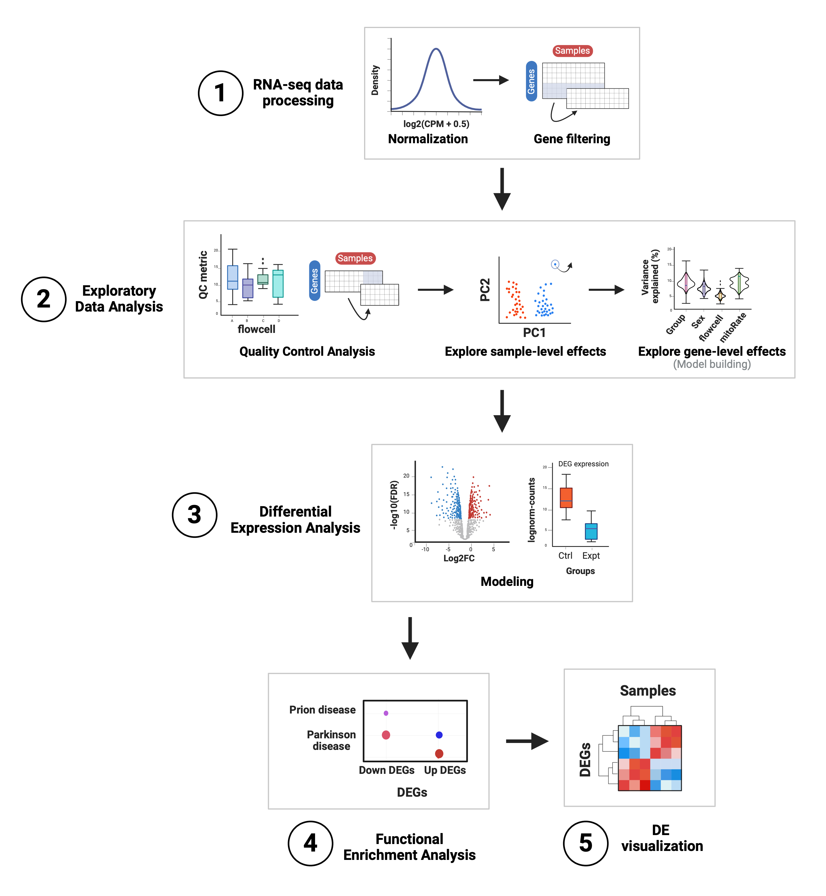
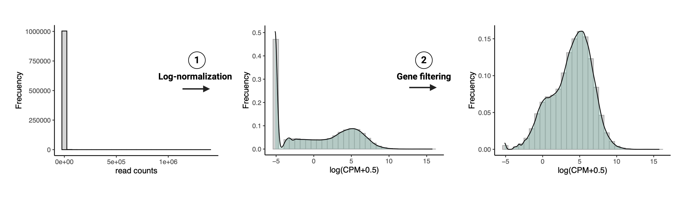

# Differential Gene Expression analysis overview

Instructor: Daianna González Padilla

Differential Gene Expression (**DGE**) analyses are common statistical analyses of gene expression data that aim to discover genes significantly altered in their expression levels between experimental groups, which can be given by a condition, treatment, experimental procedure/exposure, diagnostic, time points, by biological origins (e.g. differences in sex, tissue, age, species), and even by different technical methodologies. These genes are known as Differentially Expressed Genes (**DEGs**) and can be either up- or down-regulated if their expression is greater or less in one group with respect to the other(s), respectively. Diverse methods exist to perform DGE and multiple downstream analyses can be applied on DEGs, but a series of non-skippable preliminary steps exists which are necessary to correctly perform previous to any statistical testing. 

Below a classic workflow for DGE is depicted. It takes as input the gene expression matrix with raw read counts for genes (as rows) across all samples (as columns). Among the preliminary steps, there is an initial data processing step encompassing count normalization and filtering of lowly-expressed genes. Secondly, Exploratory Data Analysis (**EDA**) involves assessment of Quality Control (**QC**) metrics of the samples and filtering of poor-quality ones, as well as an examination of the gene expression profiles between sample groups, potential detection of additional atypical samples to remove, and the exploration of the correlations between sample-level variables and their contributions in the expression variance of each gene to guide the covariate selection for DGE models. 

<figure>
    
        <figcaption style="color: gray; line-height: 0.9; text-align: justify">
            
                <b>Figure 1</b>: <b> Summary of the analyses for differential expression. </b> 

<b> 1. RNA-seq data processing</b>: raw counts are normalized and log-scaled (lognorm counts) and the lowly-expressed genes are filtered out.

<b> 2. Exploratory Data Analysis</b>: quality metrics of the samples are compared across groups, the poor-quality samples are filtered and both sample-level and gene-level effects of sample variables are explored to identify those that are main drivers of gene expression variation to include in the models for DGE.

<b> 3. Differential Expression Analysis</b>: under the *limma*-*voom* pipeline the expression of each gene is linearly modeled by the selected variables in the previous step; after fitting the model gene-wise log2-fold changes (log2FC) and *p*-values are obtained for the variable of interest and other statistics of differential expression are also computed and compared. Here DEGs are determined based on the significance threshold (controlling for the False Discovery Rate or FDR).

<b> 4. Functional Enrichment Analysis</b>: an overrepresentation analysis (ORA) is performed to find statistically significant associations between our groups of DEGs and gene sets annotated in GO terms and KEGG pathways; here we identify biological processes, cellular functions and components, and pathways potentially affected or involved in the experimental condition under study.   

<b> 5. DE visualization</b>: heatmaps are created to visually contrast gene expression levels of DEGs in the experimental groups. 
            
                 
            
Abbreviations: CPM: counts per million; QC: quality control; PC: principal component; 
DEG(s): differentially expressed gene(s); Ctrl: control; Expt: experimental; GO: Gene Ontology; KEGG: Kyoto Encyclopedia of Genes and Genomes.
            
        </figcaption>
</figure>

## Preliminary steps

Evident computational steps right after sequencing involve raw sequencing reads Quality Control (QC) analysis and read alignment to a reference genome for the subsequent gene expression quantification, generating the input for DGE. Comprehensive pipelines have been developed for these purposes, such as the RNA-seq processing pipeline [*SPEAQeasy*](http://research.libd.org/SPEAQeasy/) (Eagles, N.J. *et al*. 2021) that provides a flexible, user-friendly, and reproducible pipeline to perform all such analyses through the implementation of a single workflow, liberating from the need of performing each step individually. 

    👉🏼 More details of this pipeline are provided in the [original manuscript](https://doi.org/10.1186/s12859-021-04142-3), the [documentation website](http://research.libd.org/SPEAQeasy/index.html), and in other [created resources](http://research.libd.org/SPEAQeasy-example/).

### RNA-seq data processing
Once the gene expression matrix has been generated we can proceed to process the read counts. Raw counts are typically zero-enriched and not normally-distributed, opposite to what is required for the application of several statistical methods. Furthermore, raw gene expression values may reflect protocol-specific biases and biological factors other than the one of interest. Therefore raw gene expression counts must be normalized and lowly-expressed genes filtered out.

#### Data normalization
Differences between samples such as library sizes (sequencing depths), and RNA composition, as well as different gene lengths and GC contents make raw gene expression data not comparable between samples. Several normalization strategies can be applied to surpass such differences; commonly counts-per-million (cpm) are used. In addition to count normalization, a log-transformation is required to make cpm follow an approximately normal distribution. 

#### Gene filtering 
Often the expression profiling platform (microarray or RNA-seq) includes genes that do not appear to be expressed to a worthwhile degree in any or most of the samples. This might occur, for instance, in cases where genes are not expressed in any of the cell types being experimentally profiled [1]. We want to remove those genes prior to posterior analyses, which is justified on both biological and statistical grounds [2]:

* Biologically, it is considered that a gene must have a minimal expression level to be translated into a protein or to be of biological importance.
* Statistically, lowly-expressed genes are unlikely to be detected as DE because low counts don't provide the required statistical evidence to assess differential expression.

Different approaches exist for this step, ranging from the simple definition of a gene expression cutoff to those taking into account not only global gene expression but also the number of samples in which they have a minimum expression level. 

    👉🏼 More details about normalization and filtering can be consulted in the course material of 2023 ([Statistical Analysis of Genome Scale Data 2023: Data preparation](https://lcolladotor.github.io/cshl_rstats_genome_scale_2023/rse-plotting-basics-with-smokingmouse.html#data-preparation)).

<figure>
    
        <figcaption style="color: gray; line-height: 0.9; text-align: justify">
            
                <b>Figure 2</b>: <b> RNA-seq data processing steps. </b> 

<b> 1. Count log-normalization</b>: distribution of read counts before and after normalization and log-transformation into $log_2(cpm+0.5)$ using `calcNormFactors()` and `cpm()` of [*edgeR*](https://bioconductor.org/packages/3.17/bioc/html/edgeR.html).  
<b> 2. Gene filtering</b>: distribution of $log_2(cpm+0.5)$ before and after filtering lowly-expressed genes; note the elimination of counts that were originally zeros.
            
        </figcaption>
</figure>

### Exploratory Data Analysis
The Exploratory Data Analysis (EDA) is a primordial step in which, as the name refers, we explore relevant aspects of the RNA-seq data. 
In this process we basically create tons of plots, charts and graphs to visualize the data, assess their quality and inspect their variability. This clearly exposes low-quality samples and relationships and contributions in gene expression variance of sample-level variables. This allows to draw valuable information from our data that could impact posterior analyses, including DGE. Thus EDA guides filtering steps, the execution of additional analyses, the selection of covariates for DGE models and of statistical tests based on data features, and could also aid in more accurate interpretations of the results. 

Although here we describe EDA as being comprised by QCA, dimensionality reduction to explore sample-level effects, and variance partition analysis to explore gene-level effects, EDA is not a well defined process that can be followed by concrete instructions or steps. The analyses you run and what you plot depends on the particular questions you're trying to answer, what you would like to know about your data and of course, it completely depends on the specific characteristics of your own dataset.

#### Quality Control Analysis (QCA)
First, the quality metrics of the samples regarding read and RNA contents, and read mapping rates have to be compared to (**Figure 3**: step 1):

 1) Identify punctual samples or groups of samples of poor quality that may have arisen by technical causes during experimental steps.  
 2) Evaluate if samples from the groups of interest for DGE (diagnostic, treatment, etc.) differ in their quality metrics as these can represent confounding factors for differential expression. 
 3) Detect high biological variability to subsequently support data partition to perform subanalyses from the data.  

Further, we are also interested in investigating trends and relationships between sample variables to unveil underlying technical and biological aspects of the observed data (**Figure 3**: step 2). 

After having identified poor-quality samples, we have to remove them to not include the unreliable expression data they provide in downstream analyses. Cutoffs can be defined for specific QC metrics to decide which samples to keep; this however, is not strongly recommended as no consolidated references exist to define such cutoffs and therefore rather represent arbitrary values. 
Other approaches include identifying outlier QC metrics (**Figure 3**: step 3), but again, caution must be taken as outlier definition is also arbitrary and we could be discarding good-quality samples.  

<figure>
    
        <figcaption style="color: gray; line-height: 0.9; text-align: justify">
            
                <b>Figure 3</b>: <b> Quality Control Analysis steps. </b> 

<b> 1. Evaluate QC metrics for groups of samples</b>: sample QC metrics such as the fraction of reads that mapped to the mitochondrial chromosome (`mitoRate`) and to the reference genome (`overallMapRate`) are compared between sample groups given by the variable of interest (`Group` in this example), technical variables (e.g. `plate` for sample library preparation), and biological variables (e.g. `Age`). 

<b> 2. Examine relationships between sample variables</b>: pairs of QC metrics are compared; here `mitoRate` and the fraction of reads assigned to rRNA genes (`rRNA_rate`), as well as the library size (`sum`) and the number of expressed genes (`detected`) are plotted to explore the relationships they present with each other and with other sample metadata variables. (`Group` and `Age`). 

<b> 3. QC-based sample filtering</b>: outlier QC metrics (red) are detected based on +/- 3 median-absolute-deviations (MADs) away (dotted lines) from the median (solid line). 

            
        </figcaption>
</figure> 

    👉🏼 See more details about QCA in [Statistical Analysis of Genome Scale Data 2023: Quality Control Analysis](https://lcolladotor.github.io/cshl_rstats_genome_scale_2023/rse-plotting-basics-with-smokingmouse.html#quality-control-analysis).

#### Exploration of sample-level effects

Sample gene expression profiles can be analyzed and compared after dimensionality reduction procedures such as Principal Component Analysis (PCA) and Multidimensional-Scaling (MDS). These analyses are useful to potentially detect samples with outlier transcriptomic profiles to further remove and to identify sample variables driving gene expression variations (**Figure 4**).

<figure>
    
        <figcaption style="color: gray; line-height: 0.9; text-align: justify">
            
                <b>Figure 4</b>: <b>  Exploration of sample-level effects through PCA</b> 

<b> 1. Detection of atypical samples (manual PCA-based sample filtering)</b>: PCx vs PCy plots can expose outlier samples that appear segregated from the rest (purple-squared sample) or samples of a particular group (`Sex`: `F` or `M`) closer to samples from the other group (blue-squared sample). These should be further examined to evalute if they can be kept or must be discarded. In this case, after removing them, PC2 that explains a higher % of variance in gene expression, separates samples by sex. 

<b> 2. Identification of drivers of sample gene expression variation</b>: reducing the dimensionality of our data enables to recognize sample variables explaining differences in the gene expression of the samples (`Age`), ascertain technical variables and batch effects are not impacting on the transcriptome (`plate`), and inquire to what extent our variable of interest is contributing to changes in gene expression (`Group`). 
            
        </figcaption>
</figure> 

#### Model building: covariate selection for *limma*-*voom* 

DGE methods fitting linear models to gene expression data to assess if a covariate impacts significantly on the expression of a gene, require the selection of sample-level variables to model transcriptomic data. 
If very few variables are present, normally they are all included in the model but that’s not often the case with RNA-seq and it doesn't represent a well founded strategy. Usually, multiple technical and biological variables are implicated in the experiments and sample QC metrics can affect the gene expression levels, even after count normalization, whereas other variables are redundant and/or minimally informative. Therefore, we’d like to identify an optimal set of variables to adjust gene expression for, in addition to the covariate of interest.

We have already introduced one first approximation to that with PCA as this analysis allows us to identify variables explaining high percentages of gene expression variance between samples. In **Chapter 7** we will review how correlation and variance partition analyses at the gene level can help us determine a suitable set of highly explanatory variables. 

## Differential Gene Expression 
Different mathematical and statistical approaches exist to compare gene expression between two or more conditions. In **Chapter 5** we'll briefly introduce methods based on the negative binomial distribution and address how to perform DGE under the empirical Bayes *limma*-*voom* framework, distinguishing how it operates, its main specifications, inputs, and outputs. 

## Downstream analyses
After finding DEGs, volcano plots and heat maps are commonly used to graphically represent them, plotting relevant information about them and their expression levels, respectively. In **Chapter 5** we'll also check how to create and interpret these plots.

## References {-}
1. Smyth, G. K., Ritchie, M., Thorne, N., Wettenhall, J., Shi, W., & Hu, Y. (2002). limma: linear models for microarray and RNA-Seq data user’s guide. Bioinformatics Division, The Walter and Eliza Hall Institute of Medical Research, Melbourne, Australia.

2. Chen, Y., Lun, A. T., & Smyth, G. K. (2016). From reads to genes to pathways: differential expression analysis of RNA-Seq experiments using Rsubread and the edgeR quasi-likelihood pipeline. F1000Research, 5.
