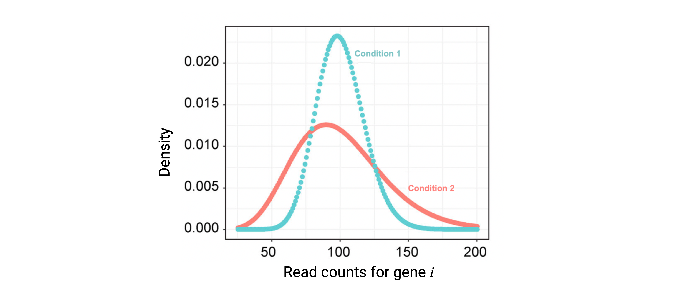
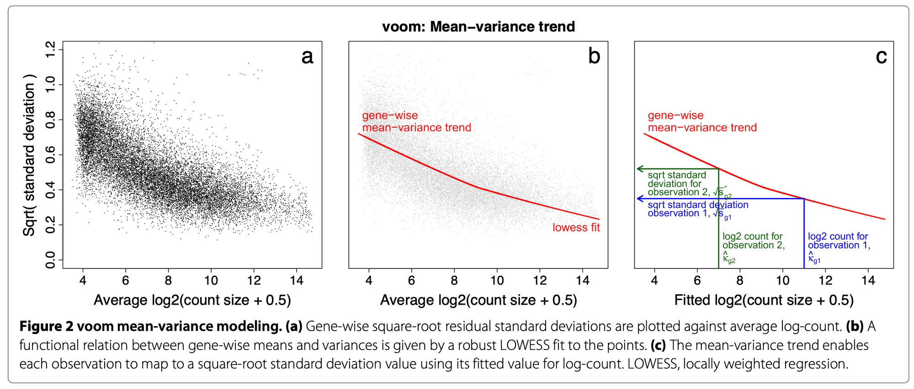
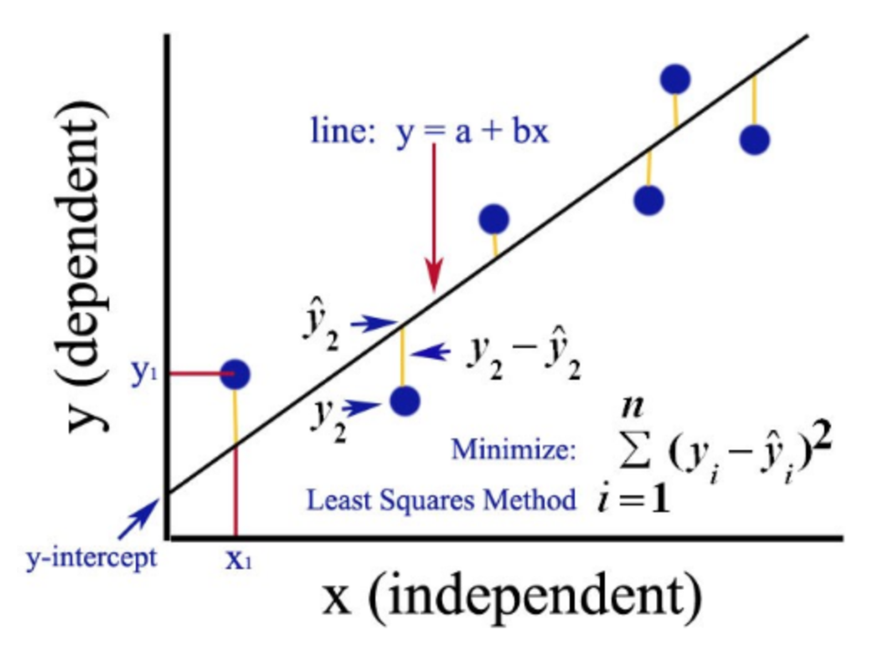

# Differential Gene Expression analysis with *limma*-*voom*

Instructor: Daianna González Padilla

In this chapter you'll learn how DGE analysis is performed under the empirical Bayes framework of the popular *limma*-*voom* pipeline, highlighting key assumptions and concepts, and main differences with other methodologies.

## NB-based DGE methods?

An initial central point of discussion around DGE method development is how to model the distribution of the reads. Many methods model the read counts ($y_{k,ij}$, non-negative integers) of a gene $i$ in the $j$ samples of condition $k$ through the Poisson or the Negative Binomial (NB) distribution. Of these, NB is often preferred as it allows the mean ($\mu$) and the variance ($\sigma$) of the reads to be different, compared to the Poisson distribution where $\mu$=$\sigma$. This is of particular importance as controlling the variance allows to account for variability in the gene expression levels across biological samples [1]. 

<figure>
    
        <figcaption style="color: gray; line-height: 0.9; text-align: justify">
            <font size="-1.8">
                <b>Figure 1</b>: <b> NB-distributed read counts. </b> Modeling of read counts for gene $i$ in the samples of the first and second conditions based on the NB model. Modified from [Li, W. V., & Li, J. J. (2018)](https://pubmed.ncbi.nlm.nih.gov/31456901/). 
                
            </font>
        </figcaption>
</figure>


Estimating the NB distribution parameters is necessary to assess DE of each gene $i$ between any two conditions $k=1,2$ (**Figure 1**). Bayesian models are used defining prior distributions and relationships of such parameters. Briefly, after 1) estimating gene-wise NB parameters, 2) the mean-variance relationship across all genes can be used to shrink the gene variance estimations borrowing information from all genes or incorporating prior knowledge, something advantageous when sample sizes are small. 3) A statistical test is used to assess for each gene $i$ if its true expression in the first and second condition ($\theta_{1i}$ and $\theta_{2i}$) is the same (null hypothesis) or differs (alternative hypothesis):

* $H_0: \theta_{1i}=\theta_{2i}$
* $H_1: \theta_{1i}≠\theta_{2i}$, where the $\theta_{i}$'s are parameters included in the mean of the NB distributions ($\mu$). 

4\) The test statistic is computed for each gene and 5) its associated *p*-value is calculated based on the null distribution. 6) Finally, *p*-values are corrected for multiple-testing and DEGs are determined based on an adjusted *p*-values cutoff [1].

Examples of popular methods based on the NB distribution are [*edgeR*](https://bioconductor.org/packages/edgeR) and [*DESeq2*](https://bioconductor.org/packages/DESeq2). 

Nevertheless, one limitation NB-based methods face is that they set dispersion of the data as a known and global parameter, ignoring observation-specific variation and importantly, there's a reduced number of statistical methods for count distributions compared to the normal distribution [1,2]. Here, we'll focus on [*limma*](https://bioconductor.org/packages/limma) that does not rely on a certain distribution but rather works on $log_2(cpm)$ (CPM: counts per million) and fits linear models for DGE enabling the incorporation of additional predictors to model gene expression, a feature specially valuable for complex experimental settings.   


 
## *limma*-*voom* pipeline

[*limma*](https://bioconductor.org/packages/limma) is a package for the analysis of gene expression data arising from microarray or RNA-seq technologies. It has features that make the analyses stable even for experiments with small number of arrays or samples —this is achieved by borrowing information across genes. It is specially designed for analyzing complex experiments with a variety of experimental conditions and predictors [3].

Usually, *limma* DGE analysis is carried out in five main steps, the last four of them completed by *limma* `R` functions, as described below. We'll use bulk RNA-seq data from the [*smokingMouse*](https://bioconductor.org/packages/smokingMouse) package to exemplify these steps. 

```{r download_data_DGE, warning=FALSE, message=FALSE}
## Load the container package for RSE
library("SummarizedExperiment")

## Connect to ExperimentHub
library("ExperimentHub")
eh <- ExperimentHub::ExperimentHub()

## Load package datasets
myfiles <- query(eh, "smokingMouse")

## Download the mouse gene data
rse_gene <- myfiles[["EH8313"]]

## Samples from the nicotine experiment and from pups only
rse_gene_nic <- rse_gene[, which(rse_gene$Expt == "Nicotine" & rse_gene$Age == "Pup")]

## Retain only expressed genes (passed the filtering step)
rse_gene_filt <- rse_gene_nic[
    rowData(rse_gene_nic)$retained_after_feature_filtering,
]
```

Let's explore a little the data.
```{r explore_data}
## Data dimensions: number of genes and samples
dim(rse_gene_filt)

## Raw counts for first 3 genes in the first 5 samples
assays(rse_gene_filt)$counts[1:3, 1:5]

## Log-normalized counts for first 3 genes in the first 5 samples
assays(rse_gene_filt)$logcounts[1:3, 1:5]

## Data for the first 2 samples
head(colData(rse_gene_filt), 2)
```

<p class="exercise">
📝 **Exercise 1**: in order for you to perform a DGE analysis, locate your own RNA-seq datasets if you have any, or download expression data from a study of your interest and build a `RSE` object using *recount3* (see **Chapter 3: recount3 introduction**). A third option you have is to download gene expression data from the [*smokingMouse*](http://research.libd.org/smokingMouse/index.html) package used here. A fourth option is to download data from GEO as Sean Davis will explain next. We'll have more time tomorrow for doing this exercise with data of your choosing.
<p/>

### `model.matrix()`

*limma* fits a linear model to the expression data of each gene (response variable), modeling the systematic part of the data by sample-level covariates (predictors). 

<style>
p.exercise {
background-color: #FFFAFA;
padding: 15px;
border: 2px solid black;
margin-left: 0px;
border-radius: 1px;
font-family: sans-serif;
}
</style>


<style>
p.info {
background-color: #FFFFF0;
padding: 20px;
border: 1px solid black;
margin-left: 0px;
border-radius: 1px;
font-family: sans-serif;
}
</style>


<style>
p.conclusion {
background-color: #EEE9E9;
padding: 20px;
border: 1px solid black;
margin-left: 0px;
border-radius: 1px;
font-family: sans-serif;
}

</style>


<style>
p.question{
background-color: #E3E3E3;
padding: 20px;
border: 1px solid black;
margin-left: 0px;
border-radius: 1px;
font-family: sans-serif;
}
</style>


<style>
p.link{
background-color: #FFFFFF;
padding: 10px;
border: 0px solid black;
margin-left: 0px;
border-radius: 1px;
font-size: 13px;
font-family: sans-serif;
}
</style>


<style>
p.comment {
background-color: #F0F0F0;
padding: 20px;
border: 0px solid black;
margin-left: 0px;
border-radius: 1px;
font-family: sans-serif;
}
</style>


<style>
p.alert {
background-color: #FFE4E1;
padding: 14px;
border: 0px solid black;
margin-left: 0px;
border-radius: 1px;
font-family: sans-serif;
}
</style>


<style>
p.success {
background-color: #E0EEE0;
padding: 14px;
border: 0px solid black;
margin-left: 0px;
border-radius: 1px;
font-family: sans-serif;
}
</style>


<p class="info">
💡 A model is a specification of how a set of variables relate to each other. In the case of a linear model, it is a linear equation that describes how the dependent or response variable is explained by the independent variables, also called predictors. A regression analysis with more than one independent variable is called **multiple regression**. Regression with only one independent variable is called **simple regression** [4].
</p>

The *limma* model is specified with a **design matrix**, also known as **model matrix** or **regressor matrix**, often denoted by $X$. This is a matrix of values for explanatory variables of the samples: rows correspond to samples and columns to sample variables. 

Say that the values the $i$th sample take in the $h$ covariates are $X_{ih}$'s and their coefficients are $\beta_{h}$'s. The predicted expression of a gene in the  $i$th sample is given by $\hat y_i =\beta_0 + \sum_{1}^h\beta_{h}X_{ih}$. 

$$
\hat y = X\beta=\displaystyle {\begin{bmatrix} \hat y_{1}\\ \hat y
_{2}\\ \hat y_{3}\\...\\ \hat y_{n-1}\\ \hat y_{n}\end{bmatrix}}={\begin{bmatrix}1&X_{11}&X_{12}&X_{13}&\cdots&X_{1,h-1}&X_{1h}\\1&X_{21}&X_{22}&X_{23}&\cdots&X_{2,h-1}&X_{2h}\\1&X_{31}&X_{32}&X_{33}&\cdots&X_{3,h-1}&X_{3h} \\ \vdots & \vdots & \vdots & \vdots & \ddots & \vdots & \vdots \\1&X_{n-1,1}&X_{n-1,2}&X_{n-1,3}&\cdots&X_{n-1,h-1}&X_{n-1,h} \\1&X_{n,1}&X_{n,2}&X_{n,3}&\cdots&X_{n,h-1}&X_{n,h} \end{bmatrix}}{\begin{bmatrix}\beta _{0}\\\beta _{1}\\\beta _{2}\\\beta_{3}\\...\\\beta_{h-1}\\\beta_{h}\end{bmatrix}}
$$
where $n$ is the number of samples. 

In the first step we create this matrix using `model.matrix()` that receives a formula with the variables to include in the models and the sample data.

```{r model.matrix()}
## Define formula
formula <- ~ Group + Sex + flowcell + mitoRate + overallMapRate + totalAssignedGene + detected + ERCCsumLogErr

## Model matrix
model <- model.matrix(formula, data = colData(rse_gene_filt))
head(model)
```

<p class="question">
❓ **Which variables to include as covariates in the models?** A straightforward strategy is to keep the model as **simple as possible** and after fitting the model evaluate the comparisons of interest [3]. In **Chapter 7** we will discuss how correlation and variance partition analyses can help us to set up the best models.
 </p>

<p class="alert">
⚠️ **Very important**: always check which condition group is set as the reference in you model for the coefficient/contrast of interest (column named as `[Coefficient_name][Reference_Group]`; corresponding reference group set to 1) as this determines if a DEG is up or downregulated in the given condition compared to the other.</p>

```{r coeff}
## Comparison of interest: Group
coef <- "GroupExperimental"
```

<p class="exercise">
📝 **Exercise 2**: identify the sample data of your study and create the respective design matrix. Which is the reference group for your main variable of interest?
Tomorrow we will learn how to use `ExploreModelMatrix` for helping us interpret coefficients.
<p/>


### `voom()`

Compared to NB-based methods, *limma* works with $log2(cpm)$ which are approximately normally distributed (as we have seen) and thus, opens the possibility to leverage a wide range of normal-based statistical tools not available for count distributions, including methods developed for microarray data. However, *limma* doesn't assume nor require data to follow a normal distribution, but it does apply normal-based microarray-like statistical methods to RNA-seq read counts [2].

>  "... limma does not make any assumption that the data appears normal in a histogram." 
<div align="right"> \- Gordon Smyth, author of *limma*, in the [Bioconductor support website](https://support.bioconductor.org/p/9140296/#9156131) 2021. </div>


The benefit of using $log2(cpm)$, however, is not immediate. One limitation for the direct application of normal-based methods to log-counts is that reads counts have unequal variabilities even after a log-transformation depending on the count sizes: probability distributions for counts are naturally heteroscedastic, with log-cpm not having constant variances (larger variances for larger counts) [2]. It has been proposed that to design powerful statistical analysis for RNA-seq, it is more important to model the relationship between the mean and the variance in the data than to specify which probabilistic distribution to use for the counts [2]. And importantly, converting count data taking such relationship into account does open up access to their analysis with normal-based methods. That’s why we use `voom()`. 

What `voom()` does is:

1. First, to compute log-cpm. Log-normalized expression for gene $g$ in sample $i$ ($y_{gi}$) is given by  
$$
y_{gi}=log_2(\frac{r_{gi} + 0.5}{R_i + 1.0} \times 10^6)
$$
    where $r_{gi}$ is the raw count for the gene in the sample and $R_i$ the library size of the sample.
    We add +0.5 to the counts to avoid log of zero and +1 to the library size to 
ensure that $\frac{r_{gi}+0.5}{R_i+1}$ is strictly less than 1 (if $r_{gi} = R_i$).

2. A linear model is fitted to gene log-cpm values by ordinary least squares as:
$$ E(y_{gi})=\mu_{gi}=X_i\beta_g $$
    where $E(y_{gi})$ is the expected expression of gene $g$ in sample $i$, $X_i$ is the vector with the sample values for the covariates and $\beta_g$ the vector of covariate coefficients for the gene. As a result, we have the estimated $\hat\beta_g$, the fitted log-cpm’s $\hat\mu_{gi}=X_i\hat\beta_g$ and the residual standard deviations $s_g$.

3. Then it estimates the mean-variance trend of the data by fitting a smooth curve to the $\sqrt s_g$ of the genes presented as a function of the average gene         expression (in log-counts, not log-cpm). The $\sqrt s_g$‘s are used because they are symmetrically distributed. Log-counts typically show a decreasing mean-variance trend.

4. `voom()` then predicts the standard deviation of each individual normalized observation $y_{gi}$ (*limma*-trend does that at the gene level) using this trend curve: the fitted log-count of each observation is mapped to the curve and its $\sqrt s_{gi}$value is obtained. The observation weights are $w_{gi}=\frac{1}{s_{gi}^2}$.

<figure>
    
        <figcaption style="color: gray; line-height: 0.9; text-align: justify">
            <font size="-1.8">
                <b>Figure 2</b>: <b> `voom()` procedure to estimate observation-level variance weights for *limma*. </b> Extracted from the original voom publication ( [Law, C. W. *et al*. 2018](https://genomebiology.biomedcentral.com/articles/10.1186/gb-2014-15-2-r29)). 
                
            </font>
        </figcaption>
</figure>

5. Log-cpm ($y_{gi}$) and associated weights ($w_{gi}$) can then be entered into the *limma* framework for linear modeling. These weights are used in the linear modeling to adjust for count heteroscedasticity [2].

```{r voom}
library("limma")

## voom():
#   1. Transform counts to log2(cpm)
#      ----------------------------------------------------------------------------
# .     |   Note we passed voom() raw counts as input, not the lognorm counts!!!   |
#      ----------------------------------------------------------------------------
#   2. Estimate mean-variance relationship for each gene
#   3. Compute observation weights for limma (next step)

vGene <- voom(assay(rse_gene_filt), design = model, plot = TRUE)
```

Let's explore the outpus of this function.
```{r voom_outs}
## Returned data
names(vGene)

## E: contains the computed log(cpm)
dim(vGene$E)
vGene$E[1:5, 1:5]

## weights: contains the computed variance weight for each observation
dim(vGene$weights)
vGene$weights[1:5, 1:5]

## design: is the provided design matrix
head(vGene$design)

## targets: the sample library sizes used to compute log(cpm) in the first step
dim(vGene$targets)
head(vGene$targets)

identical(vGene$targets$lib.size, colSums(assay(rse_gene_filt)))
```

<p class="conclusion">
➡️ In summary, `voom()` estimates non-parametrically the global mean-variance trend of the count data based on the expression of the genes and uses that to predict the variance of each individual expression observation (each log-cpm value) based on their predicted count sizes. The predicted variances are then associated as inverse weights to each observation that when used in linear modeling eliminate the log-cpm mean-variance trend [2]. 
 </p>


<div style="background-color:#E0EEE0; padding:20px; font-family: sans-serif">
<p>
👉🏼 **Advantages**:
<ul>
<li>✅ `voom()` estimates the mean-variance relationship in a non-parametric way. </li>
 <blockquote class="ludwig">
    "The parametric advantages of the Poisson or NB distributions are mitigated by the fact that the observed mean-variance relationship of RNA-seq data does not perfectly match the theoretical mean-variance relationships inherent in these distributions. While the quadratic mean-variance relationship of the NB distribution captures most of the mean-variance trend, the NB dispersion still shows a non-ignorable trend with gene abundance." [2]
 </blockquote>
<li>✅ Since `voom()` is a method to adapt count data to normal models, these give access to tractable empirical Bayes distribution theory. </li>
<li>✅ The use of normal distribution approaches and variance modeling is supported by generalized linear model theory. </li>
</ul>
</p>
</div>

<p>

</p>


<p class="exercise">
📝 **Exercise 3**: compute the $log2(cpm)$ and the residual variance weights for each observation in your data using `voom()`.
<p/>


### `lmFit()`

This *limma* function fits a **multiple linear model** to the expression of each gene by weighted or generalized least squares to estimate the coefficients of the sample covariates which correspond to the logFC's comparing gene expression between sample groups. 

**Ordinary least squares (OLS)**

This is used to estimate the coefficients of a linear regression by minimizing the residual sum of squares [5].

<div style="text-align: center">
<figure>
    
        <figcaption style="color: gray; line-height: 0.9; text-align: justify; caption-side: bottom">
            <font size="-1.8">
                <b>Figure 3</b>: <b> Graphical representation of the OLS method for simple regression analysis</b>. Source: Gulve, A. (2020). Ordinary Least Square (OLS) Method for Linear Regression. 
                
</font>
</figcaption>
</figure>
</div>

For simplicity, let’s work with one gene and say we have $n$ samples. The fitted expression of the gene in the $j$th sample is $\hat y_j =\beta_{0} + \sum_{1}^h\beta_{h}X_{jh}$ , where $\beta_h$  is the coefficient for the $h$th covariate and $X_{jh}$ the value the $j$th sample takes for the $h$th covariate. It can also be written as $\hat y_j =\sum_{0}^h\beta_{h}X_{jh}$  if $X_{j0}=1$.

So we have an overdetermined system of $n$ linear equations and $h$ unknown parameters with $n>h$:

$\hat y_j =\sum_{0}^h\beta_{h}X_{jh}$  with $j=(1,2, ..., n)$. 

Such system usually has no exact solution, so we need to estimate the coefficients that better fit the data in a linear regression. The problem is reduced to solving a quadratic minimization problem:

 $\hat \beta=arg \ _\beta\ min \ \ S(\beta)$ where $S(\beta)=\sum_j(y_j -\hat y_j)^2=RSS$ (residual sum of squares).

<div style="background-color:#FFFFF0; padding:20px; font-family: sans-serif; border: 1px solid black">
💡 We can think of these $\beta$’s as differences in the fitted (expected) expression of a gene. Say we have two binary categorical variables in the model ($X_1$ and $X_2$), then the expected gene expression in a sample is $E(y|X_1, X_2) =\hat y =\beta_{0} + \beta_1X_1+\beta_2X_2$, where $X_1$ and $X_2$ equal to 1 or 0. Then we have the following 4 combinations:

- <mark style= "background-color: #FAECF8"> $E(y|X_1=1, X_2=1) = \mu_{12}=\beta_{0} + \beta_1+\beta_2$ </mark>
- <mark style= "background-color: #FCF3CF"> $E(y|X_1=1, X_2=0) =\mu_{1}=\beta_{0} + \beta_1$ </mark>
- <mark style= "background-color: #FAECF8"> $E(y|X_1=0, X_2=1) =\mu_{2}=\beta_{0} + \beta_2$ </mark>
- <mark style= "background-color: #FCF3CF"> $E(y|X_1=0, X_2=0) =\mu_{0}=\beta_{0}$ </mark>

 So $\beta_1=$  <mark style= "background-color: #FCF3CF">$\mu_1-\mu_0$</mark>   $=$   <mark style= "background-color: #FAECF8"> $\mu_{12}-\mu_2$ </mark>  and $\beta_2=$ <mark style= "background-color: #FAECF8">$\mu_2$</mark>$-$ <mark style= "background-color: #FCF3CF">$\mu_0$</mark>. Say our variable of interest is $\beta_1$. Then what we are testing is if the expected expression of a gene is different when $X_1=1$ (in the first sample group) and $X_1=0$ (in the second sample group), fixing $X_2$ in either 1 or 0.    
</div>

<p>

</p>

**Generalized least squares (GLS)**

Is a generalization of OLS that allows for heteroskedasticity and correlation between the residuals [6].

**Weighted least squares (WLS)** 

In this case the function to be minimized becomes the weighted sum of the squared residuals: squared residuals are weighted by the reciprocal of their variance so that more noisy observations have less weight. That’s what we used `voom()` for.

`lmFit()` returns a fitted model object with the estimated **coefficients**, **standard errors** ($SE=sd/\sqrt n$) and **residual standard errors/deviations** ($RSE=s_g=\sqrt {RSS/ n-2}$) for each gene. Depending on the arguments and correlations in the data, this function calls one of the following functions to fit a linear model for each gene [7]:

- `mrlm`: for a robust regression if `method="robust”`.
- `gls.series`: GLS estimator if `method="ls”` and a correlation structure has been specified.
- `lm.series`: OLS method if `method="ls”` and there is no correlation structure.

For the `weights` argument of `lmFit()`, the precision weights for the observations previously computed are extracted from the `voom()` output.

```{r lmFit}
## lmFit():
#   1. Fit linear model for each gene to estimate logFCs
fitGene <- lmFit(vGene)

## Corroborate "ls" method was applied
fitGene$method

## Explore outputs: estimated coefficients (logFCs)
head(fitGene$coefficients)
```

<div style="background-color:#FFFFF0; padding:20px; font-family: sans-serif; border: 1px solid black">
💡 **Interaction terms in linear models**

There may be cases where we want to assess gene expression differences between 2 conditions within more than one specific group; for example if we were interested in knowing what are the effects of a treatment ($X_1=1$ for treatment and 0 for controls) in <mark style= "background-color: #FAECF8">females</mark> and <mark style= "background-color: #E0FFFF">males</mark> separately ($X_2=1$ for females and 0 for males). In such cases we can fit an **interaction model** in which we include the product of $X_1$ and $X_2$ so that $X_1X_2=1$ if a sample comes from a female that was treated and 0 otherwise:

$$E(y|X_1, X_2) =\beta_{0} + \beta_1X_1+\beta_2X_2 + \beta_3X_1X_2$$

- <mark style= "background-color: #FAECF8"> $E(y|X_1=1, X_2=1) =\mu_{12} =\beta_{0} + \beta_1+\beta_2+\beta_3$ </mark>
- <mark style= "background-color: #E0FFFF"> $E(y|X_1=1, X_2=0) =\mu_{1} =\beta_{0} + \beta_1$ </mark>
- <mark style= "background-color: #FAECF8"> $E(y|X_1=0, X_2=1) =\mu_{2} =\beta_{0} + \beta_2$ </mark>
- <mark style= "background-color: #E0FFFF"> $E(y|X_1=0, X_2=0) =\mu_{0} =\beta_{0}$ </mark>

$\beta_1 + \beta_3=$ <mark style= "background-color: #FAECF8">$\mu_{12}-\mu_2$</mark> which is the expression difference between treated and control female samples ($X_2=1$) and $\beta_1 =$ <mark style= "background-color: #E0FFFF">$\mu_{1}-\mu_0$</mark> for male samples ($X_2=0$). Finally $\beta_3$, called the **interaction term**, is (<mark style= "background-color: #FAECF8">$\mu_{12}-\mu_2$</mark>)$-$(<mark style= "background-color: #E0FFFF">$\mu_1-\mu_0$</mark>), described as the difference in gene expression changes driven by the treatment in females compared to males [8].
</div>

<p>

</p>

<p class="exercise">
📝 **Exercise 4**: fit a linear regression model to the expression data of your genes and extract the coefficients for the included covariates.
<p/>


### `eBayes()`
Next, we want to assess if the differences in gene expression between the sample groups are statistically significant. Initially, we can think of comparing the mean expression of a gene in the sample groups (e.g. cases and controls) which can be handled applying a **two-sample *t*-test**  assuming that the values in both groups have an approximately normal distribution.

Here we use the *t*-score (***t*-stats**) to define if the difference in the means is statistically significant based on a *t*-distribution. 

The *t*-stats is given by:

$$
t=\frac{\bar x_1 - \bar x_2}{\sqrt{\frac{s_1^2}{n_1}+\frac{s_2^2}{n_2}}}
$$

where $\bar x_1$ and $\bar x_2$ are the means of the expression values of a gene in the first and second sample groups, $s_1$ and $s_2$ are the sample standard deviations of gene expression in the same groups, and $n_1$, $n_2$ the corresponding sample group sizes:  

 $s_1 = \sqrt{\frac{\sum_{i=1}^ {n_1} (x_i-\bar x_1)^2}{n_1-1}}$ and  $s_2 = \sqrt{\frac{\sum_{j=1}^ {n_2} (x_j-\bar x_2)^2}{n_2-1}}$, with $x_i$ and $x_j$ the gene expression values in the samples of group 1 and 2, respectively. 

<p class="question">
➡️ Note that we say *sample* means and *sample* standard deviations because they are estimators of the population parameters, computed based on the data that we have.
</p>

We can think of this *t*-stats as a ratio of signal and noise. The numerator contains the difference between the two means, taken as the **signal** for DE. The denominator corresponds to the **standard error** and represents the **noise** in terms of gene expression variance within the sample groups. This represents how spread out the signal is [9]. In that way, the *t*-stats is a measure of how strong is the DE signal. Once computed, the *t*-stats have an associated *p*-value based on a Student *t*-distribution under the null hypothesis ($H_o$:  $\bar x_1 - \bar x_2=0$).

This is exactly what we can get using `lm()`:
```{r lm}
## Lognorm expression of first gene
rse_gene_one_gene <- rse_gene_filt[1, ]
colData(rse_gene_one_gene) <- cbind(colData(rse_gene_one_gene),
    "lognorm_expr" = assays(rse_gene_one_gene)$logcounts[1, ]
)


## Fit simple linear model
formula <- lognorm_expr ~ Group
lm <- lm(formula, data = colData(rse_gene_one_gene))
summary(lm)

## Two sample t-test
t.test(formula, data = colData(rse_gene_one_gene), var.equal = TRUE)
```

<p class="info">
💡 Sample sizes are critical! Larger sample sizes increase the power of the tests and reduce the false discovery rate (FDR) as they decrease the denominator of the *t*-stats (increasing their values) and slight differences can then be detected. 
</p>

<p class="alert">
⚠️ Now consider that for genes with small variances in their expression the *t*-stats will be greater and we could be detecting non-DEGs as DE (false positives).
</p>

But two things must be considered at least when working with gene expression data:

1. The first is that expression values are usually not normally distributed.
2. Second, the distributions and variances of expression values vary across genes and conditions.

<p class="question">
➡️ With that in mind, inference at the individual gene level can be addressed borrowing information from all the genes in the experiment through a Bayes or empirical Bayes method that produces more powerful tests.
</p>

The idea of **Bayesian statistics** is to give unknown quantities a prior distribution, considering each feature as a member of a population of features such as genes. More specifically, **empirical Bayes methods** are procedures for statistical inference in which the (empirical) prior distribution is estimated from the population of all features (from the data) [8]; in standard Bayesian methods this prior distribution is fixed before observing any data [10].

Inspired by the work of Lönnstedt and Speed (2002) in which a simple expression for the posterior odds of differential expression for each gene was computed using a parametric empirical Bayes approach, [Smyth, G. K. (2004)](https://doi.org/10.2202/1544-6115.1027) generalized this model for its application to experiments with any numbers of samples and conditions and reformulated the posterior odds statistic in terms of a **moderated *t*-statistic** in which the posterior residual standard deviations are used instead of the ordinary ones, eliminating the requirement of knowing the non-null prior guess for the proportion of differentially expressed genes required in the log-odds [11]. Let’s see how it proceeds. 

First, for each gene $g$ we have a vector with the expression values in the $n$ samples: 

$$
y_{g}= (y_{g1}, y_{g2}, ..., y_{gn})
$$

We already know that the expected (predicted) gene expression in the samples is $E(y_{g})=X\alpha_g$ with $X$ the design matrix and $\alpha_g$ the vector of the coefficients for the $h$ covariates in the model; of these the ones of biological interest are the $\beta_g$’s (contrasts of interest).

Then, as previously described, a linear model is fitted to the expression data for each gene to obtain the **coefficient estimators** ($\hat \alpha_g$) (as well as $\hat \beta_g$), the **residual sample variances** ($s_g^2$) as estimators of the (true but unknown) residual variances ($\sigma_g^2$), and the estimated covariance matrices.

Two relevant considerations here: 

1. The expression values are not necessarily assumed to be normally distributed. 
2. The linear model is not assumed to be necessarily by least squares.

However, there are two assumptions:

1. The contrast estimators $\hat \beta_g$ are assumed to be approximately normally distributed with mean $\beta_g$.
2. The residual sample variances ($s_g^2$) are assumed to follow approximately a scaled chisquare distribution.

Under such assumptions the ordinary *t*-stats for the covariate $j$ in the gene $g$ is defined by:

$$
t_{gj}=\frac{\hat \beta_{gj}}{s_g u_{gj}}=\frac{\hat \beta_{gj}}{SE(\hat \beta_{gj})}
$$

with $s_g$ the residual sample standard deviation of the gene and $u_{gj}$ the unscaled standard deviation. $SE$ stands for standard error.

The key step in the empirical Bayes approach of *limma* is to leverage the information across all genes by defining prior distributions for the unknown coefficients $\beta_{gj}$ and residual variance $\sigma_g^2$ of the genes. 

* For $\beta_{gj}$ it models the prior distribution of the coefficients that are not zero, i.e. is the expected distribution of the **logFC** of the genes that are DE, is given by:
    $$\beta_{gj}|\sigma_{g}^2, \beta_{gj}≠0  \sim N(0, v_{0j}\sigma_g^2)$$
    
    > "Saying that the betas have prior information centered around zero implies that we are ignorant of the sign (**+**/**-**) of the beta."
    <div align="right"> \– Vincent Carey (personal communication)</div>

<p>

</p>

* For the residual variances what *limma* does is to take the residual sample variances of all genes ($s_g^2$’s) and estimate the empirical parameters of the gamma distribution it is assumed that they follow. Specifically, $\frac{1}{\sigma_g^2}$ is modeled by a scaled chisquare (gamma) prior distribution with mean $\frac{1}{s_0^2}$ and $d_0$ degrees of freedom, describing how the residual variances are expected to vary across genes:
    $$\frac{1}{\sigma_g^2} \sim \frac{1}{d_0s_0^2}\chi_{d_0}^2$$

What we want to do next is not only to take the mean of the residual variances in the distribution (prior mean$\frac{1}{s_0^2}$) but to estimate each gene residual variance as a Bayes predictor: as a weighted average of the **prior mean** ($\frac{1}{s_0^2}$) and the observed **sample variance** ($s_g^2$) of each gene. This is called the **moderated variance** and what is graphically happening is that we are pulling the observed gene variances towards the prior mean variance: large variances are reduced and the |*t*-stats| increases (more powerful *t*-test for those genes) and small variances are increased, decreasing the |*t*-stats| and the power of the *t*-test. Under this model the **posterior residual sample variance** or posterior residual variance estimator ($\tilde s_g^2$) is: 

$$
\tilde s_g^2=E(\sigma_g^2|s_g^2)=\frac{d_0s_0^2 + d_gs_g^2}{d_0+d_g}
$$

Moderation is somehow like having larger sample sizes for the estimation of variance given that the moderated variances are (on average) closer to the population variance than the original sample variances.

The **moderated *t*-statistic** can be now defined in terms of this **posterior residual sample standard deviations** instead of the usual ones:

$$
\tilde t_{gj}=\frac{\hat \beta_{gj}}{\tilde s_g u_{gj}}
$$

These moderated *t*-stats follow a *t*-distribution under the null hypothesis ($H_o:B_{gj}=0$) with degrees of freedom $d_g+d_0$ and the associated *p*-values can be computed based on such distribution.

As previously stated, with this redefined formula, large *t*-stats merely from very small $s_g$’s are avoided. This results in increased power and reduced false non-discovery rate (FNR) (non detected DEGs) and the number of DEGs obtained increases [8].

In the end we say we have moderated the residual sample standard deviations of each gene in the *t*-stats denominator by using the distribution of all of them across the population of genes. 

<div style="background-color:#E0EEE0; padding:14px; font-family: sans-serif">
✅ The approach of using the posterior values results in shrinking the gene-wise residual sample variances ($s_g^2$) towards the prior mean, making a more stable inference when a small number of samples is available. </div>

<p>

</p>

`eBayes()` will implement this empirical Bayes model to compute for each gene and for each contrast these moderated *t*-statistic and their unadjusted *p*-values. Additionally, it returns moderated F-statistic and log-odds of differential expression. The moderated F-statistic tests whether any of the contrasts for a gene is non-zero ($H_0:B_{g}=0$), i.e., whether that gene is differentially expressed for any contrast; it is similar to the ordinary F-statistic from analysis of variance (ANOVAR). The *t*-test does that for each individual contrast $j$ ($H_0:B_{gj}=0$).

<p class="link">
    👉🏼 Check more about F-stats and other statistics computed by `eBayes()` here: https://support.bioconductor.org/p/6124/.
</p>

```{r eBayes}
## eBayes()
## 1. Compute the empirical Bayes statistics for DE
eBGene <- eBayes(fitGene)

## Outputs of interest:
## s2.prior -> prior residual variance (prior mean 1/s0^2)
##             in prior distribution of residual variances
eBGene$s2.prior

## df.prior -> degrees of freedom d0 in prior distribution
##             of residual variances
eBGene$df.prior

## s2.post -> posterior residual sample variances of the genes (~sg^2)
length(eBGene$s2.post)
head(eBGene$s2.post)

##  t -> moderated t-stats of the genes for each contrast
dim(eBGene$t)
eBGene$t[1:5, 1:5]

## p.value: corresponding unadjusted p-values of moderated t-stats
dim(eBGene$p.value)
eBGene$p.value[1:5, 1:5]
```

<p class="exercise">
📝 **Exercise 5**: obtain the moderated *t*-stats and associated *p*-values of all genes in you data for all covariates included in your model.
<p/>

<p>

</p>

### `topTable()`

This function is also provided by *limma* and summarizes the results of the linear model, performs hypothesis tests and adjusts the *p*-values for multiple testing [12]. Among the summary statistics presented, it returns the log2FCs, moderated *t*-statistics, *p*-values, and FDR-adjusted *p*-values of the genes for a given contrast of interest. The default form of *p*-value adjustment is the **Benjamini and Hochberg’s** method to control the false discovery rate (FDR) which assumes independence between genes.

**Relevant concepts**: 

* ***q*-value** → is the **FDR-adjusted *p*-value** used to control the **False Discovery Rate (FDR)** that is the expected proportion of false discoveries among the discoveries (DEGs). Selecting discoveries as those being below $\alpha$ in *q*-value, we control FDR ≤ $\alpha$.

Now we have the final statistics to determine wich genes are DE.
```{r topTable}
## topTable()
## 1. Obtain gene-wise DE stats for Group (Nicotine vs Ctrl)
top_genes <- topTable(eBGene, coef = coef, p.value = 1, number = nrow(rse_gene_filt), sort.by = "none")

## Outputs for each gene and for the coeff selected (Group):
##  logFC: log2-fold-changes
head(top_genes$logFC)
```

In limma the $\beta_{gj}$‘s are the logFC’s:
```{r betas_logFCs}
setdiff(top_genes$logFC, eBGene$coefficients[, "GroupExperimental"])
```

```{r topTable2}
##  t: moderated t-stats
head(top_genes$t)

## . P.value: unadjusted p-values of t-stats
head(top_genes$P.Value)

##  adj.P.Val: p-values adjusted to control the FDR
head(top_genes$adj.P.Val)
```

After running all these 5 steps, one main initial plot we have to look at is the histogram of the *p*-values of the moderated *t*-stats of the genes. If there were DEGs, we'd expect to see a flat distribution of *p*-values corresponding to non-DEGs and a peak near *p*=0 for DEGs (for which we reject the null hypothesis). If this peak is absent but a uniform distribution still appears, DEGs might be detected after correcting for multiple testing. 

```{r hist_p}
## Histogram of unadjusted p-values
hist(top_genes$P.Value, xlab = "p-values", main = "")
```


If very different *p*-value distributions are obtained from the uniform one, the best we can do is trying to explore if there are specific groups of genes (e.g. lowly-expressed genes) presenting such variable *p*-values and revisiting the assumptions and considerations of the statistical tests implemented [13]. 


<p class="exercise">
📝 **Exercise 6**: obtain the DE logFCs, *t*-stats, *p*-values, and adjusted *p*-values of the genes for a given constrast/covariate under study. 
</p>


## DE visualization
DEGs are identified defining a significance threshold (on the adjusted *p*-values). Let's quantify the number of DEGs for nicotine exposure in pup brain and visualize their expression and DE statistics.

```{r quantify_DEGs}
## DEGs for FDR<0.05
de_genes <- top_genes[which(top_genes$adj.P.Val < 0.05), ]

## Number of DEGs
dim(de_genes)
```

### Volcano plots
A very practical and useful plot to graphically represent DEGs and visualize their expression differences between conditions is a volcano plot. This is a scatter plot of the logFC's of the genes in the x-axis vs their adjusted *p*-values in a -log scale in the y-axis. 

```{r volcano plot, warning=FALSE, message=FALSE}
library("ggplot2")

## Define up- and down-regulated DEGs, and non-DEGs
FDR <- 0.05
DE <- vector()
for (i in 1:dim(top_genes)[1]) {
    if (top_genes$adj.P.Val[i] > FDR) {
        DE <- append(DE, "n.s.")
    } else {
        if (top_genes$logFC[i] > 0) {
            DE <- append(DE, "Up")
        } else {
            DE <- append(DE, "Down")
        }
    }
}
top_genes$DE <- DE

## Colors, sizes and transparencies for up & down DEGs and non-DEGs
cols <- c("Up" = "indianred2", "Down" = "steelblue2", "n.s." = "grey")
sizes <- c("Up" = 1.3, "Down" = 1.3, "n.s." = 0.8)
alphas <- c("Up" = 0.4, "Down" = 0.6, "n.s." = 0.5)

## Plot volcano plot
ggplot(
    data = top_genes,
    aes(
        x = logFC, y = -log10(adj.P.Val),
        color = DE,
        fill = DE,
        size = DE,
        alpha = DE
    )
) +
    geom_point(shape = 21) +
    geom_hline(
        yintercept = -log10(FDR),
        linetype = "dashed", color = "gray35", linewidth = 0.5
    ) +
    geom_vline(
        xintercept = c(-1, 1),
        linetype = "dashed", color = "gray35", linewidth = 0.5
    ) +
    labs(y = "-log10(FDR)", x = "logFC(Nicotine vs Control)") +
    theme_bw() +
    scale_color_manual(values = cols, name = "Differential expression") +
    scale_fill_manual(values = cols, name = "Differential expression") +
    scale_size_manual(values = sizes, name = "Differential expression") +
    scale_alpha_manual(values = alphas, name = "Differential expression") +
    theme(
        plot.margin = unit(c(1, 1, 1, 1), "cm"),
        legend.key.height = unit(0.15, "cm"),
        axis.title = element_text(size = (13)),
        legend.title = element_text(size = 13),
        legend.text = element_text(size = 12)
    )
```

### Heat maps
Another common way to represent differential expression results is through a heat map. The package [*ComplexHeatmap*](https://bioconductor.org/packages/release/bioc/html/ComplexHeatmap.html) offers a flexible toolkit to easily create heat maps with row and column annotations, a feature of particular value to plot expression data of genes across samples with multiple biological and technical differences. Although initially all genes in your data can be plotted, frequently only DEGs are included as they tend to show clearer gene expression patterns. 

```{r complexHeatmap, warning=FALSE,message=FALSE}
library("ComplexHeatmap")

## We plot lognorm counts
lognorm_data <- assays(rse_gene_filt)$logcounts

## Subset to DEGs only
lognorm_data <- lognorm_data[rownames(de_genes), ]

## Define column (sample) names to display
colnames(lognorm_data) <- paste0("Pup_", 1:dim(lognorm_data)[2])
```


<div style="background-color:#EDEDED; padding:20px; font-family: sans-serif; border: 1px solid black">
🗒️ **Notes**:

1) It is sometimes convenient to regress out the technical variables' contributions on gene expression to see more clearly the effects of interest. This can happen, for instance, when the logFCs are too small to see any significant differences in the plots or when there are other strong confounding factors. Functions such as [`cleaningY()`](https://rdrr.io/github/LieberInstitute/jaffelab/man/cleaningY.html) of *jaffelab* can be used for this purpose.

2) The lognorm counts have to be correctly scaled and centered (around zero) to make the differences in the expression of the genes more notorious in the heat map. A simple way to do that is substracting from each lognorm count $y_{gi}$ (from the gene $g$ and sample $i$) the mean expression of the gene* and dividing by the standard deviation ($\sigma$) of the same gene expression values. This is formally called the *z*-score: the number of standard deviations away from the mean.

$$
z=\frac{y_{gi} - \frac{\sum_{k=1}^{n}{y_{gk}}}{n}}{\sigma},
$$
$n$ is the number of samples.

<font size="2"> \* This can also be done by columns (samples), not only by rows (genes). </font>

<p class="link" style="background-color:#EDEDED">
    👉🏼 For more on centering and scaling, see this video:
</p>

<p class="link" style="background-color:#EDEDED; text-align: center">
    <iframe width="560" height="315" src="https://www.youtube.com/embed/c8ffeFVUzk8" title="YouTube video player" frameborder="0" allow="accelerometer; autoplay; clipboard-write; encrypted-media; gyroscope; picture-in-picture; web-share" allowfullscreen></iframe>
</p>

</div>

<p>

</p>


```{r scale_data}
## Center and scale the data to make differences more evident
lognorm_data <- (lognorm_data - rowMeans(lognorm_data)) / rowSds(lognorm_data)

## Sample annotation: Sex, Group, and library size
col_anno <- HeatmapAnnotation(
    df = as.data.frame(colData(rse_gene_filt)[, c("Sex", "Group")]),
    library_size = anno_barplot(colData(rse_gene_filt)$sum, gp = gpar(fill = "lightyellow2")),
    col = list(
        "Sex" = c("F" = "hotpink1", "M" = "dodgerblue"),
        "Group" = c("Control" = "gray68", "Experimental" = "gold2")
    )
)

## Gene annotation: logFC and biotype
de_genes$logFC_binary <- sapply(de_genes$logFC, function(x) {
    if (x > 0) {
        ">0"
    } else {
        "<0"
    }
})
de_genes$protein_coding_gene <- sapply(rowData(rse_gene_filt[rownames(de_genes), ])$gene_type, function(x) {
    if (x == "protein_coding") {
        "TRUE"
    } else {
        "FALSE"
    }
})

gene_anno <- rowAnnotation(
    df = as.data.frame(cbind(
        "logFC" = de_genes$logFC_binary,
        "protein_coding_gene" = de_genes$protein_coding_gene
    )),
    col = list(
        "logFC" = c("<0" = "deepskyblue3", ">0" = "brown2"),
        "protein_coding_gene" = c("TRUE" = "darkseagreen3", "FALSE" = "magenta")
    )
)
```

```{r heat map, warning=FALSE, message=FALSE, fig.width=10,fig.height=6.9}
library("circlize")

## Plot
Heatmap(lognorm_data,
    name = "lognorm counts",
    show_row_names = FALSE,
    top_annotation = col_anno,
    left_annotation = gene_anno,
    row_km = 2,
    column_km = 2,
    col = colorRamp2(c(-4, -0.0001, 00001, 4), c("darkblue", "lightblue", "lightsalmon", "darkred")),
    row_title = "DEGs",
    column_title = "Samples",
    column_names_gp = gpar(fontsize = 7),
    heatmap_width = unit(12.5, "cm"),
    heatmap_height = unit(12.5, "cm")
)
```

<p class="exercise">
📝 **Exercise 7**: obtain the number of DEGs you got and represent them in a volcano plot and a heat map. Include all the sample and gene information you consider relevant in the latter. 
</p>


## References {-}

1. Li, W. V., & Li, J. J. (2018). Modeling and analysis of RNA‐seq data: a review from a statistical perspective. Quantitative Biology, 6(3), 195-209.

2. Law, C. W., Chen, Y., Shi, W., & Smyth, G. K. (2014). voom: Precision weights unlock linear model analysis tools for RNA-seq read counts. Genome biology, 15(2), 1-17.

3. Smyth, G. K., Ritchie, M., Thorne, N., Wettenhall, J., Shi, W., & Hu, Y. (2002). limma: linear models for microarray and RNA-Seq data user’s guide. Bioinformatics Division, The Walter and Eliza Hall Institute of Medical Research, Melbourne, Australia.

4. van den Berg, S. M. (2022). Analysing data using linear models. Web site: https://bookdown.org/pingapang9/linear_models_bookdown/

5. Wikipedia. (n.d.). Ordinary least squares. Web site: https://en.wikipedia.org/wiki/Ordinary_least_squares

6. Taboga, Marco (2021). "Generalized least squares", Lectures on probability theory and mathematical statistics. Kindle Direct Publishing. Online appendix. https://www.statlect.com/fundamentals-of-statistics/generalized-least-squares.

7. Documentation for lmFit: https://rdrr.io/bioc/limma/man/lmFit.html

8. The Pennsylvania State University. (2018). Statistical Analysis of Genomics Data. Web site: https://online.stat.psu.edu/stat555/node/36/

9. Tushe, M. (2021). A Simple Trick to Understand the t-test. Web site: https://miroslavtushev.medium.com/a-simple-trick-to-understand-the-t-test-2c2a9e7f1dc5

10. Wikipedia. (n.d.). Empirical Bayes method. Web site: https://en.wikipedia.org/wiki/Empirical_Bayes_method#:~:text=Empirical Bayes methods are procedures,before any data are observed.

11. Smyth, G. K. (2004). Linear models and empirical bayes methods for assessing differential expression in microarray experiments. Statistical applications in genetics and molecular biology, 3(1).

12. Documentation for topTable: https://www.rdocumentation.org/packages/limma/versions/3.28.14/topics/toptable

13. Robinson, D. (2014). How to interpret a p-value histogram. Web site: http://varianceexplained.org/statistics/interpreting-pvalue-histogram/
