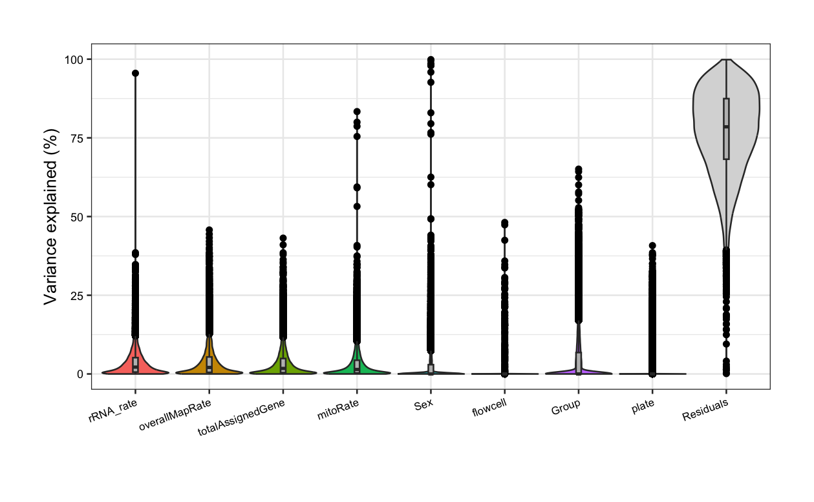
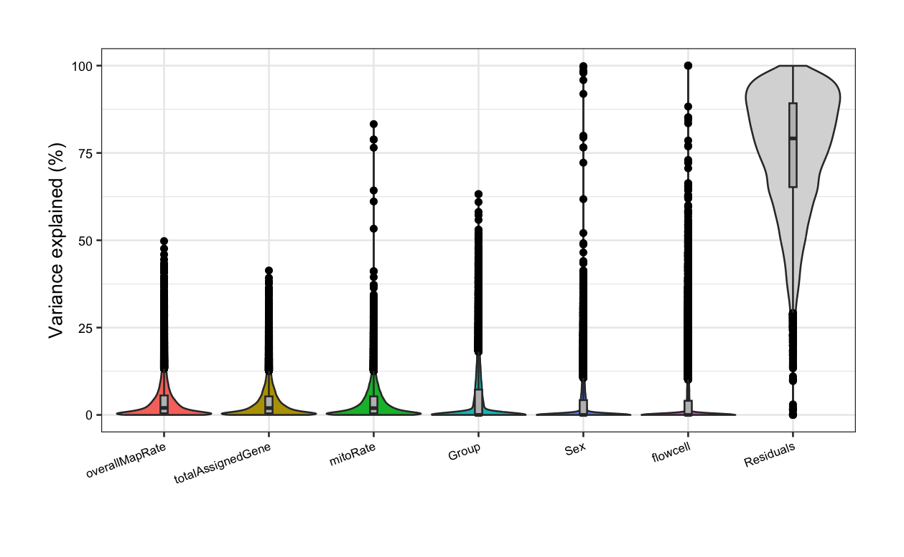
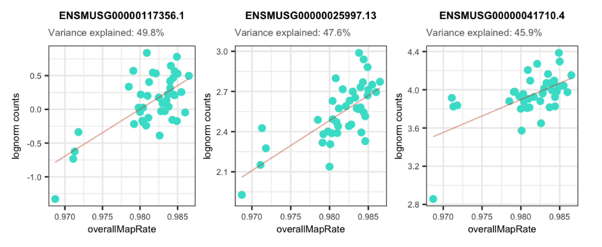
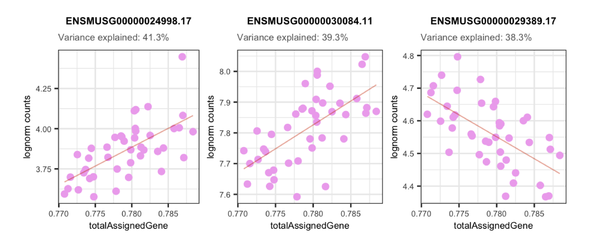
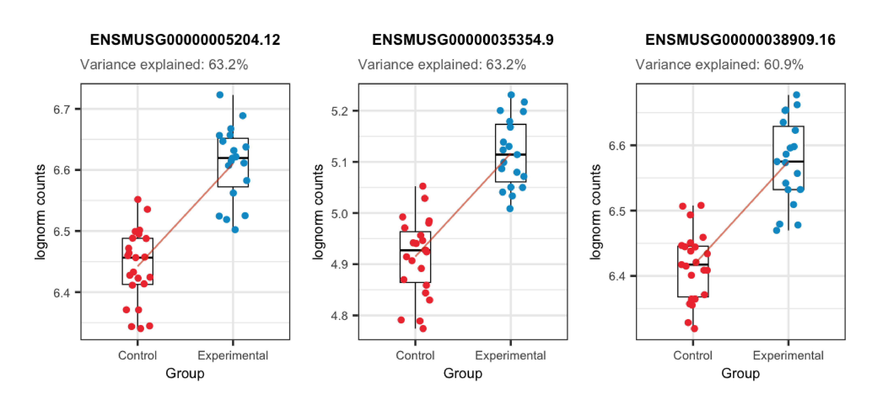
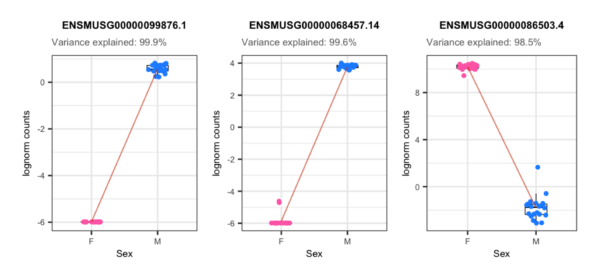

# DGE model building with *variancePartition*

Instructor: Daianna González-Padilla

After having processed RNA-seq data and assessed the quality and the variability of the samples the next step for DGE is to explore the variance in the expression of the genes themselves according to sample groups, or in other words, to quantify the contribution of the multiple sample variables in the gene expression variation.

To determine which variables are the major drivers of expression variability, and importantly to define if the technical variability of RNA-seq data is low enough to study the condition of interest, we can implement an analysis of variance partition. [*variancePartition*](https://www.bioconductor.org/packages/variancePartition) is a package that decomposes for each gene the expression variation into fractions of variance explained (FVE) by the sample variables in the experimental design of high-throughput genomics studies [1].


In order to exemplify how to implement this analysis and the type of conclusions that can be drawn from it, we'll use bulk RNA-seq data from the [*smokingMouse*](https://bioconductor.org/packages/smokingMouse) package.

```{r download_data, warning=FALSE, message=FALSE}
## Load the container package for this type of data
library("SummarizedExperiment")

## Connect to ExperimentHub
library("ExperimentHub")
eh <- ExperimentHub::ExperimentHub()

## Load the datasets of the package
myfiles <- query(eh, "smokingMouse")

## Download the mouse gene data
rse_gene <- myfiles[["EH8313"]]

## Keep samples from nicotine experiment and pups only
rse_gene_nic <- rse_gene[
    ,
    which(rse_gene$Expt == "Nicotine" & rse_gene$Age == "Pup")
]

## Use expressed genes only (i.e. that passed the filtering step)
rse_gene_filt <- rse_gene_nic[
    rowData(rse_gene_nic)$retained_after_feature_filtering,
]

## Keep samples that passed QC and manual sample filtering steps (all passed)
rse_gene_filt <- rse_gene_filt[
    ,
    rse_gene_filt$retained_after_QC_sample_filtering &
        rse_gene_filt$retained_after_manual_sample_filtering
]
```


## Canonical Correlation Analysis 

Prior to the variance partition analysis, evaluating the correlation between sample variables is crucial because highly correlated variables can produce unstable estimates of the variance fractions and impede the identification of the variables that really contribute to the expression variation. There are at least two problems with correlated variables:

* If two variables are highly correlated we could incorrectly determine that one of them contributes to gene expression changes when it was actually not explanatory but just correlated with a real contributory variable.
* The part of variance explained by a biologically relevant variable can be reduced by the apparent contributions of correlated variables, if for example, they contain very similar information (i.e. are redundant variables).

Additionally, the analysis is better performed with simpler models, specially when we have a limited number of samples in the study. 
 
Hence, to remove such variables we must first identify them. We will perform a Canonical Correlation Analysis (CCA) with `canCorPairs()` that assesses the degree to which the variables co-vary and contain the same information. With CCA, linear combinations that maximize the correlation between variable sets are estimated. CCA is just like a normal correlation analysis between 2 vectors but it can accommodate matrices as well (variable sets). Note that CCA returns correlations values between 0 and 1 [2].


```{r CCA, message=FALSE, warning=FALSE, out.height=7, out.width=7}
library("variancePartition")
library("pheatmap")

## Plot heatmap of correlations
## Define all variables to examine; remove those with single values
formula <- ~ Group + Sex + plate + flowcell + mitoRate + overallMapRate + totalAssignedGene + rRNA_rate + sum + detected + ERCCsumLogErr

## Measure correlations
CCA <- canCorPairs(formula, colData(rse_gene_filt))
## Heatmap
pheatmap(
    CCA, ## data
    color = hcl.colors(50, "YlOrRd", rev = TRUE), ## color scale
    fontsize = 8, ## text size
    border_color = "black", ## border color for heatmap cells
    cellwidth = unit(0.4, "cm"), ## height of cells
    cellheight = unit(0.4, "cm") ## width of cells
)
```

<style>
p.alert {
background-color: #FFE4E1;
padding: 14px;
border: 0px solid black;
margin-left: 0px;
border-radius: 1px;
font-family: sans-serif;
}
</style>

<p class="alert">
⚠️ **Very important**: always inspect if there are any correlated variables with the one of interest in your study! This is extremely important as correlated variables could represent confounding factors and/or hinder the detection of significant DE events, thus yielding to misleading results.
</p>

Importantly, `Group` is not highly correlated with any other variable in this study, but `overallMapRate` is correlated with `rRNA_rate`, library preparation `plate`, and the sequencing `flowcell`; `sum` (library size) and `detected` (number of expressed genes) are also correlated. For a detailed definition of these variables check [here](https://lcolladotor.github.io/cshl_rstats_genome_scale_2023/smokingmouse-rse.html).

Depending on your results there's sometimes convenient to dig a little deeper into the relationship between correlated variables and to analyze these metrics among our control and experimental samples. Let's work on that! 

```{r message=FALSE, warning=FALSE}
library("ggplot2")
library("cowplot")

## Boxplots/Scatterplots/Barplots for each pair of correlated variables

corr_plots <- function(sample_var1, sample_var2, sample_color) {
    ## Define sample colors by variable
    colors <- list(
        "Group" = c("Control" = "brown2", "Experimental" = "deepskyblue3"),
        "Sex" = c("F" = "hotpink1", "M" = "dodgerblue"),
        "plate" = c("Plate1" = "darkorange", "Plate2" = "lightskyblue", "Plate3" = "deeppink1"),
        "flowcell" = c(
            "HKCG7DSXX" = "chartreuse2", "HKCMHDSXX" = "magenta",
            "HKCNKDSXX" = "turquoise3", "HKCTMDSXX" = "tomato"
        )
    )

    data <- colData(rse_gene_filt)

    ## a) Barplots for categorical variable vs categorical variable
    if (class(data[, sample_var1]) == "character" & class(data[, sample_var2]) == "character") {
        ## y-axis label
        y_label <- paste("Number of samples from each ", sample_var2, sep = "")

        ## Stacked barplot with counts for 2nd variable
        plot <- ggplot(data = as.data.frame(data), aes(
            x = !!rlang::sym(sample_var1),
            fill = !!rlang::sym(sample_var2)
        )) +
            geom_bar(position = "stack") +
            ## Colors by 2nd variable
            scale_fill_manual(values = colors[[sample_var2]]) +
            ## Show sample counts on stacked bars
            geom_text(aes(label = after_stat(count)),
                stat = "count",
                position = position_stack(vjust = 0.5), colour = "gray20", size = 3
            ) +
            theme_bw() +
            labs(
                subtitle = paste0("Corr: ", signif(CCA[sample_var1, sample_var2], digits = 3)),
                y = y_label
            ) +
            theme(
                axis.title = element_text(size = (7)),
                axis.text = element_text(size = (6)),
                plot.subtitle = element_text(size = 7, color = "gray40"),
                legend.text = element_text(size = 6),
                legend.title = element_text(size = 7)
            )
    }


    ## b) Boxplots for categorical variable vs continuous variable
    else if (class(data[, sample_var1]) == "character" & class(data[, sample_var2]) == "numeric") {
        plot <- ggplot(data = as.data.frame(data), mapping = aes(
            x = !!rlang::sym(sample_var1),
            y = !!rlang::sym(sample_var2),
            color = !!rlang::sym(sample_var1)
        )) +
            geom_boxplot(size = 0.25, width = 0.32, color = "black", outlier.color = NA) +
            geom_jitter(width = 0.15, alpha = 1, size = 1.5) +
            stat_smooth(method = "lm", geom = "line", alpha = 0.6, size = 0.4, span = 0.3, aes(group = 1), color = "orangered3") +
            scale_color_manual(values = colors[[sample_var1]]) +
            theme_bw() +
            guides(color = "none") +
            labs(
                subtitle = paste0("Corr: ", signif(CCA[sample_var1, sample_var2], digits = 3)), y = gsub("_", " ", sample_var2),
                x = sample_var1
            ) +
            theme(
                axis.title = element_text(size = (7)),
                axis.text = element_text(size = (6)),
                plot.subtitle = element_text(size = 7, color = "gray40"),
                legend.text = element_text(size = 6),
                legend.title = element_text(size = 7)
            )
    }


    ## c) Scatterplots for continuous variable vs continuous variable
    else if (class(data[, sample_var1]) == "numeric" & class(data[, sample_var2]) == "numeric") {
        plot <- ggplot(as.data.frame(data), aes(
            x = !!rlang::sym(sample_var1),
            y = !!rlang::sym(sample_var2),
            color = !!rlang::sym(sample_color)
        )) +
            geom_point(size = 2) +
            stat_smooth(method = "lm", geom = "line", alpha = 0.6, size = 0.6, span = 0.25, color = "orangered3") +
            ## Color by sample_color variable
            scale_color_manual(name = sample_color, values = colors[[sample_color]]) +
            theme_bw() +
            labs(
                subtitle = paste0("Corr: ", signif(CCA[sample_var1, sample_var2], digits = 3)),
                y = gsub("_", " ", sample_var2),
                x = gsub("_", " ", sample_var1)
            ) +
            theme(
                axis.title = element_text(size = (7)),
                axis.text = element_text(size = (6)),
                plot.subtitle = element_text(size = 7, color = "gray40"),
                legend.text = element_text(size = 6),
                legend.title = element_text(size = 7)
            )
    }

    return(plot)
}
```


As shown below, `Group` and `plate` are moderately correlated given that 14 of the 23 (60.8%) control samples and 11 of the 19 (57.9%) exposed samples were in the first and second plate for library preparation, respectively. 

```{r message=FALSE, warning=FALSE}
## Correlation plot for Group and plate
p <- corr_plots("Group", "plate", NULL)
p + theme(plot.margin = unit(c(1, 5.5, 1, 5.5), "cm"))
```

We can also observe that even though QC metrics such as `overallMapRate` and `rRNA_rate` are correlated, there's no distinction between control and exposed samples for these variables. 

```{r message=FALSE, warning=FALSE}
## Correlation plot for overallMapRate and rRNA_rate
p <- corr_plots("overallMapRate", "rRNA_rate", "Group")
p + theme(plot.margin = unit(c(2, 3.5, 2, 3.5), "cm"))
```


Moreover, the correlation between `overallMapRate` and the library preparation `plate` is mainly given by the plate 1 samples that have lower rates, similar to what occurs with the samples from the first flowcell. 

```{r message=FALSE, warning=FALSE}
## Correlation plot for overallMapRate and plate
p <- corr_plots("plate", "overallMapRate", NULL)
p + theme(plot.margin = unit(c(2, 5, 2, 5), "cm"))
```

```{r message=FALSE, warning=FALSE}
## Correlation plot for overallMapRate and flowcell
p <- corr_plots("flowcell", "overallMapRate", NULL)
p + theme(plot.margin = unit(c(2, 5, 2, 5), "cm"))
```
 
Interestingly, control samples seem to present more expressed genes than exposed samples for a given library size, 
however none of these variables is correlated with `Group`.

```{r message=FALSE, warning=FALSE}
## Correlation plots for sum and detected
p <- corr_plots("sum", "detected", "Group")
p + theme(plot.margin = unit(c(2, 3.5, 2, 3.5), "cm"))
```

<div style="background-color:#FFFFFF; padding:20px; font-family: sans-serif; border: 2px solid black">
❓ Now look at the following plot. **Why is it important that experimental and control samples are distributed throughout all sequencing flowcells?** 

```{r message=FALSE, warning=FALSE}
p <- corr_plots("Group", "flowcell", NULL)
plots <- plot_grid(p)
plots + theme(plot.margin = unit(c(0.5, 5, 0.5, 5), "cm"))
```

***Hint***: What would happen if all experimental samples were in one flowcell and all controls in another?
</div>

<p>

</p>

After identifying which variables are correlated and exploring the metrics of control and experimental samples the next is to determine which variable from each pair of correlated variables should be discarded and which one included in the models. How do we discern which ones to keep? As recommended in the *variancePartition* user’s guide [2], initially we can fit a linear model to the expression data of each gene taking all sample variables and then investigate which ones explain higher percentages of variance for many genes. But first let's review how *variancePartition* works. 


## Fit model and extract fraction of variance explained

Briefly, what *variancePartition* does is to fit a linear model for each gene separately and to compute the fraction of the total data variance explained by each variable of the study design, as well as by the residuals, using the `calcVarPart()` function. These computed fractions of variation explained (FVE) summarize the contribution of each variable and naturally sum to 1 [1].

*variancePartition* fits two types of models:

1. **Linear mixed model (LMM)** where all categorical variables are modeled as **random effects** and all continuous variables are **fixed effects**. The function `lmer()` from *lme4* is used to fit this model. 

```r
## Fit LMM specifying the existence of random effects with '(1| )' 
fit <- lmer(expr ~ a + b + (1|c), data=data)
```

2. Fixed effects model, which is basically the **standard linear model (LM)**, where all variables are modeled as fixed effects. The function `lm()` is used to fit this model.

```r
## Fit LM modeling all variables as fixed effects
fit <- lm(expr ~ a + b + c, data=data)
```

In our case, the function will be modeled as a mixed model since we have both effects.

<style>
p.question{
background-color: #E3E3E3;
padding: 20px;
border: 1px solid black;
margin-left: 0px;
border-radius: 1px;
font-family: sans-serif;
}
</style>

<p class="question">
❓ **What are random and fixed effects?** 
Categorical variables are usually modeled as **random effects**, i.e., variables such as flowcell, plate, donor, etc. whose levels are "randomly chosen or selected from a larger population". These levels are not of interest by themselves but the grouping of the samples by them. Random effects correspond to those variables whose effect on the expression of a gene varies according to its sample groups/levels. On the other hand, continuous variables can be modeled as **fixed effects**. These are sample-level variables that preserve their impact on the expression of a gene irrespective of the sample.
</p>

<p class="question">
❓ **Why is this effect distinction important?**
Because when we have clustered data, like gene expression values grouped by sample sex, batch, etc. we are violating the relevant assumption of independence, making an incorrect inference when using a **general linear model (GLM)**. If we have clustered data where the variables' values have distinct effects on gene expression, we must work with an extension of GLM, i.e. with the **linear mixed model (LMM)** that contains a mix of both fixed and random effects [3].
</p>


**Linear mixed model fit**

<aside>
1️⃣ After fitting a linear model to the expression data of each gene we obtain the predicted expression of the genes given by the estimated coefficients of the variables:

$\hat y =\sum_{1}^j\beta_{j}X_{j} + \sum_{1}^k\alpha_{k}Z_{k}$  ← the expression of a gene across all samples is given by the samples' values in the $j$ fixed effects and $k$ random effects. Therefore, the gene expression in the sample $i$ is given by $\hat y_i =\sum_{1}^j\beta_{j}X_{ij} + \sum_{1}^k\alpha_{k}Z_{ik}$.

Then $y=\hat y+\epsilon$, which means that the true (observed) expression value is given by the predicted value plus an error term ($\epsilon$), also called noise or residual:

$$y =\sum_{1}^j\beta_{j}X_{j} + \sum_{1}^k\alpha_{k}Z_{k} + \epsilon$$  

- $X_j$ is the vector of the values of the samples in the $j$th fixed effect.
- $\beta_j$ is the predicted coefficient of the fixed effect $j$.

$$
X_j\beta_j=  \ \ _{n \ \ samples}\stackrel{j^{th}\ \ fixed\ \ effect }{\begin{bmatrix} X_{1j} \\ ... \\ X_{(n-1)j} \\ X_{nj}  \end{bmatrix}}\beta_j = {\begin{bmatrix}  X_{1j}\beta_j \\ ... \\ X_{(n-1)j}\beta_j \\ X_{nj} \beta_j \end{bmatrix}}
$$

- $Z_k$ is the vector of values the samples have for the $k$th random effect.
- $\alpha_k$ is the predicted coefficient of the random effect $k$. These are drawn from a normal distribution   $∼N(0, \sigma_{\alpha_k}^2 )$.

$$
Z_k\alpha_k= \ \ _{n \ \ samples}\stackrel{{k^{th}\ \ random\ \ effect }}{\begin{bmatrix}  Z_{1k} \\ ... \\ Z_{(n-1)k}\\ Z_{nk} \end{bmatrix}}\alpha_k = {\begin{bmatrix} Z_{1k}\alpha_k \\ ... \\ Z_{(n-1)k}\alpha_k\\ Z_{nk}\alpha_k \end{bmatrix}}
$$

$\epsilon$ is the noise term which is  $y-\hat y$, the difference between the observed and predicted expression and is also drawn from $∼N(0, \sigma_{\epsilon}^2 )$.

Expanding, 

$$
y= {\begin{bmatrix}  X_{11}\beta_1 \\ ... \\ X_{(n-1)1}\beta_1 \\ X_{n1} \beta_1 \end{bmatrix}} + {\begin{bmatrix}  X_{12}\beta_2 \\ ... \\ X_{(n-1)2}\beta_2 \\ X_{n2} \beta_2 \end{bmatrix}} + ... +{\begin{bmatrix}  X_{1j}\beta_j \\ ... \\ X_{(n-1)j}\beta_j \\ X_{nj} \beta_j \end{bmatrix}} + {\begin{bmatrix} Z_{11}\alpha_1 \\ ... \\ Z_{(n-1)1}\alpha_1\\ Z_{n1}\alpha_1 \end{bmatrix}} +{\begin{bmatrix} Z_{12}\alpha_2 \\ ... \\ Z_{(n-1)2}\alpha_2\\ Z_{n2}\alpha_2 \end{bmatrix}}
$$
$$
 + ... + {\begin{bmatrix} Z_{1k}\alpha_k \\ ... \\ Z_{(n-1)k}\alpha_k\\ Z_{nk}\alpha_k \end{bmatrix}} + {\begin{bmatrix} \epsilon_1 \\ ... \\ \epsilon_{(n-1)} \\ \epsilon_n \end{bmatrix}}
$$

All parameters are estimated with maximum likelihood, the default method in the *variancePartition* software when random effects are specified because it performs best in simulations.
</aside>


<aside>
2️⃣ Then, `calcVarPart()` computes for each fixed effect

$\sum_{i=1}^n(\beta_{j}X_{ij}-\bar{\beta_{j}X_{j}})^2=var(\beta_{j}X_{j})(n-1)$, the squared sum of the predicted expression values of a gene in the $n$ samples only taking into account the variable $j$ in the regression model: $\hat y = \beta_{j}X_{j}$. Each of these squared sums is scaled by additional factors but to simplify let's just explain this analysis in terms of the variance (that is proportional to the squared sum):

- The variance explained by the $j$th fixed effect is:  <mark style= "background-color: #FEF5E7">$\sigma_{\beta_j}^2=var(X_j{\beta_j})$</mark>

For random effects the variances are computed by variance component estimates with `VarCorr()` from `nmle`:

- The variance of the $k$th random effect is  <mark style= "background-color: #D6EAF8">$\sigma_{\alpha_k}^2=var(Z_k{\alpha_k})$</mark>

The total variance of the expression values is calculated by $\sum_{i=1}^n(y_i - \bar { y})^2=var(y)(n-1)$, where $y_i = \sum_{1}^j\beta_{j}X_{ij} + \sum_{1}^k\alpha_{k}Z_{ik} + \epsilon_i$ considering all variables in the model and the error:

- The total variance is:

$var(y)= \sigma_{Total}^2= var(X_{1}\beta_1)+var(X_{2}\beta_2)+...+var(X_{j}\beta_j)+var(Z_{1}\alpha_1)+var(Z_{2}\alpha_2)+...+var(Z_{k}\alpha_k)+var(\epsilon)=$
$\sum_1^jvar(X_j\beta_j)+\sum_1^kvar(Z_k\alpha_k)+var(\epsilon)=$

<mark style= "background-color: #F9EBEA">$\sigma_{Total}^2=\sum_1^j{ \sigma_{\beta_j}^2} + \sum_1^k{ \sigma_{\alpha_k}^2} + \sigma_{\epsilon}^2$</mark>

</aside>


<aside>
3️⃣ Finally, it computes:

- The fraction of the total data variance explained by the $j$th fixed effect is  <mark style= "background-color: #FEF5E7">$\sigma_{\beta_j}^2$</mark> /   <mark style= "background-color: #F9EBEA">$\sigma_{Total}^2$</mark>
- The fraction of the total data variance explained by the $k$th random effect is  <mark style= "background-color: #D6EAF8">$\sigma_{\alpha_k}^2$</mark> /    <mark style= "background-color: #F9EBEA">$\sigma_{Total}^2$</mark>

Note that $y=\hat y+\epsilon$ because the expression can't be completely described by a straight line, so not all the variation of $y$ can be explained by the variation of the sample variables, instead $var(y)=var(\hat y)+var(\epsilon)=var(\hat y) + \sigma_{\epsilon}^2$, where  $\sigma_{\epsilon}^2=\sum_{i=1}^n(\hat y_i -y_i)^2/n-1$.

- The residual variance is  <mark style= "background-color: #E8DAEF">$\sigma_{\epsilon}^2$</mark> /    <mark style= "background-color: #F9EBEA">$\sigma_{Total}^2$</mark> ; this is the variance that the model (with the included covariates) couldn't explain.
</aside>


<style>
p.link{
background-color: #FFFFFF;
padding: 10px;
border: 0px solid black;
margin-left: 0px;
border-radius: 1px;
font-size: 13px;
font-family: sans-serif;
}
</style>

<p class="link">
👉🏼 Source code of `calcVarPart()` [here](https://rdrr.io/github/GabrielHoffman/variancePartition/src/R/calcVarPart.R#sym-getVarianceComponents).
</p>

Once we have reviewed what *variancePartition* computes and how, we can use it to quantify the FVE for each variable. 

```{r message=FALSE, warning=FALSE, eval=FALSE}
## Fit a linear mixed model (LMM) that takes continuous variables as fixed effects and categorical variables as random effects

varPartAnalysis <- function(formula) {
    ## Ignore genes with variance 0
    genes_var_zero <- which(apply(assays(rse_gene_filt)$logcounts, 1, var) == 0)
    if (length(genes_var_zero) > 0) {
        rse_gene_filt <- rse_gene_filt[-genes_var_zero, ]
    }

    ## Loop over each gene to fit the model and extract variance explained by each variable
    varPart <- fitExtractVarPartModel(assays(rse_gene_filt)$logcounts, formula, colData(rse_gene_filt))

    # Sort variables by median fraction of variance explained (FVE)
    vp <- sortCols(varPart)
    p <- plotVarPart(vp)

    return(list(p, vp))
}
```

In the following violin plots, we have the % of variance explained in the expression of each gene by each covariate, based on the model with all variables. Of our pairs of correlated variables, `rRNA_rate` has the highest median FVE and thus, should be included in the models for DGE, whereas variables correlated with it (`overallMapRate`) must be removed. Furthermore, library preparation `plate` must be excluded as it is correlated with `Group`.

```{r message=FALSE, warning=FALSE, eval=FALSE}
#####  Fit model with all variables  #####

# sum, detected, and ERCCsumLogErr are not included as they are in very different scales!
formula <- ~ (1 | Group) + (1 | Sex) + (1 | plate) + (1 | flowcell) + mitoRate + overallMapRate +
    totalAssignedGene + rRNA_rate
plot <- varPartAnalysis(formula)[[1]]
plot + theme(
    plot.margin = unit(c(1, 1, 1, 1), "cm"),
    axis.text.x = element_text(size = (7)),
    axis.text.y = element_text(size = (7.5))
)
```
<figure>
    
</figure>

<p class="alert">
⚠️ Note that some variables such as the library size and the number of detected genes that are in different orders of magnitude to the rest of the QC metrics and categorical variables are not included in this analysis as they can impact the model predictions and the interpretability of the regression results [4]. These variables can be analyzed only after rescaling.  
</p>

After re-running the analysis without the previous correlated variables, now `Group` contribution increases but so does the residual source, i.e., the % of gene expression variance that the model couldn't explain increases, although the increase is rather low. This occurs because when we remove independent variables to a regression equation, we can explain less of the variance of the dependent variable [3]. That's the price to pay when dropping variables, but it is convenient when we don't have many samples for the model to determine variable unique contributions.  

```{r message=FALSE, warning=FALSE, eval=FALSE}
#####  Fit model without correlated variables  #####

## Pup plots without overallMapRate and plate
formula <- ~ (1 | Group) + (1 | Sex) + (1 | flowcell) + mitoRate + overallMapRate + totalAssignedGene
varPart <- varPartAnalysis(formula)
varPart_data <- varPart[[2]]
plot <- varPart[[1]]
plot + theme(
    plot.margin = unit(c(1, 1, 1, 1), "cm"),
    axis.text.x = element_text(size = (7)),
    axis.text.y = element_text(size = (7.5))
)
```
<figure>
    
</figure>

But what does it mean that a variable explains a high percentage of the expression variation of a gene? In the following section will visualize the existing relationships between the gene expression values in the samples and the sample-level variables. 


## Examine the expression of most affected genes by each sample variable

In the plots presented below we can appreciate the expression levels across samples of the most affected genes by each variable, i.e., the genes for which the variable explains the highest percentages of variance, plotted against the sample values for the same variable. Observe the strong correlations that exist for the sample variables and the gene expression of such affected genes, which ends up causing these variables to explain high percentages of gene expression variation and which obligate us to adjust for them in the models. 

```{r message=FALSE, warning=FALSE, eval=FALSE}
library("rlang")

## Plot of gene expression lognorm counts vs. sample variable
plot_gene_expr <- function(sample_var, gene_id) {
    colors <- list(
        "Group" = c("Control" = "brown2", "Experimental" = "deepskyblue3"),
        "Age" = c("Adult" = "slateblue3", "Pup" = "yellow3"),
        "Sex" = c("F" = "hotpink1", "M" = "dodgerblue"),
        "Pregnancy" = c("Yes" = "darkorchid3", "No" = "darkolivegreen4"),
        "plate" = c("Plate1" = "darkorange", "Plate2" = "lightskyblue", "Plate3" = "deeppink1"),
        "flowcell" = c(
            "HKCG7DSXX" = "chartreuse2", "HKCMHDSXX" = "magenta", "HKCNKDSXX" = "turquoise3",
            "HKCTMDSXX" = "tomato"
        )
    )

    ## Lognorm counts of the gene across samples
    data <- colData(rse_gene_filt)
    data$gene_expr <- assays(rse_gene_filt)$logcounts[gene_id, ]

    ## Percentage of variance explained by the variable
    percentage <- 100 * signif(varPart_data[gene_id, sample_var], digits = 3)

    ## Boxplots for categorical variables
    if (class(data[, sample_var]) == "character") {
        plot <- ggplot(data = as.data.frame(data), mapping = aes(
            x = !!rlang::sym(sample_var),
            y = gene_expr, color = !!rlang::sym(sample_var)
        )) +
            geom_boxplot(size = 0.25, width = 0.32, color = "black", outlier.color = "#FFFFFFFF") +
            geom_jitter(width = 0.15, alpha = 1, size = 1) +
            stat_smooth(geom = "line", alpha = 0.6, size = 0.4, span = 0.3, method = "lm", aes(group = 1), color = "orangered3") +
            scale_color_manual(values = colors[[sample_var]]) +
            theme_bw() +
            guides(color = "none") +
            labs(
                title = gene_id,
                subtitle = paste0("Variance explained: ", percentage, "%"),
                y = "lognorm counts", x = sample_var
            ) +
            theme(
                axis.title = element_text(size = (7)),
                axis.text = element_text(size = (6)),
                plot.title = element_text(hjust = 0.5, size = 7.5, face = "bold"),
                plot.subtitle = element_text(size = 7, color = "gray40"),
                legend.text = element_text(size = 6),
                legend.title = element_text(size = 7)
            )
    }

    ## Scatterplots for continuous variables
    else {
        colors <- c(
            "mitoRate" = "khaki3", "overallMapRate" = "turquoise", "totalAssignedGene" = "plum2", "rRNA_rate" = "orange3",
            "sum" = "palegreen3", "detected" = "skyblue2", "ERCCsumLogErr" = "slateblue1"
        )

        plot <- ggplot(as.data.frame(data), aes(x = eval(parse_expr(sample_var)), y = gene_expr)) +
            geom_point(color = colors[[sample_var]], size = 2) +
            stat_smooth(geom = "line", alpha = 0.4, size = 0.4, span = 0.25, method = "lm", color = "orangered3") +
            theme_bw() +
            guides(color = "none") +
            labs(
                title = gene_id,
                subtitle = paste0("Variance explained: ", percentage, "%"),
                y = "lognorm counts", x = gsub("_", " ", sample_var)
            ) +
            theme(
                plot.margin = unit(c(0.4, 0.1, 0.4, 0.1), "cm"),
                axis.title = element_text(size = (7)),
                axis.text = element_text(size = (6)),
                plot.title = element_text(hjust = 0.5, size = 7.5, face = "bold"),
                plot.subtitle = element_text(size = 7, color = "gray40"),
                legend.text = element_text(size = 6),
                legend.title = element_text(size = 7)
            )
    }

    return(plot)
}
```

```{r message=FALSE, warning=FALSE, eval=FALSE}
## Function to plot gene expression vs sample variable data for top 3 most affected genes

plot_gene_expr_sample <- function(sample_var) {
    ## Top 3 genes most affected by sample variable
    affected_genes <- rownames(varPart_data[order(varPart_data[, sample_var], decreasing = TRUE), ][1:3, ])

    ## Plots
    plots <- list()
    for (i in 1:length(affected_genes)) {
        plots[[i]] <- plot_gene_expr(sample_var, affected_genes[i])
    }
    plot_grid(plots[[1]], plots[[2]], plots[[3]], ncol = 3)
}
```

```{r message=FALSE, warning=FALSE, eval=FALSE}
## Plots for top affected genes by 'overallMapRate'
plots <- plot_gene_expr_sample("overallMapRate")
plots + theme(plot.margin = unit(c(3, 1, 2, 3), "cm"))

## Plots for top affected genes by 'totalAssignedGene'
plots <- plot_gene_expr_sample("totalAssignedGene")
plots + theme(plot.margin = unit(c(3, 1, 2, 3), "cm"))

## Plots for top affected genes by 'Group'
plots <- plot_gene_expr_sample("Group")
plots + theme(plot.margin = unit(c(3, 1, 2, 3), "cm"))

## Plots for top affected genes by 'Sex' (genes in sexual chrs)
plots <- plot_gene_expr_sample("Sex")
plots + theme(plot.margin = unit(c(3, 1, 2, 3), "cm"))
```
<figure>
    
</figure>

<figure>
    
</figure>

<figure>
    
</figure>

<figure>
    
</figure>


<style>
p.exercise {
background-color: #FFFAFA;
padding: 15px;
border: 2px solid black;
margin-left: 0px;
border-radius: 1px;
font-family: sans-serif;
}
</style>

<p class="exercise">
📝 **Exercise 1**: What % of variance does `Group` explain for the gene ENSMUSG00000042348.10? Create the boxplots for its counts in control and experimental samples. Is it more likely that the gene is up-regulated or down-regulated?
</p>


<p class="exercise">
📝 **Exercise 2**: Do the same for the gene ENSMUSG00000064372.1. What do you observe in terms of variance percentage and sample differences?
</p>


```{r exercise1_varPart, message=FALSE, warning=FALSE, echo=FALSE, eval=FALSE}
## Solution

## Gene ID
gene_id <- "ENSMUSG00000042348.10"
## % of variance explained by Group
percentage <- 100 * signif(varPart_data[gene_id, "Group"], digits = 3)
## Sample colors
colors <- c("Control" = "brown2", "Experimental" = "deepskyblue3")
## Gene expression logcounts
rse_gene_filt$gene_expr <- assays(rse_gene_filt)$logcounts[gene_id, ]

## Plot
plot <- ggplot(
    data = as.data.frame(colData(rse_gene_filt)),
    mapping = aes(x = Group, y = gene_expr, color = Group)
) +
    geom_boxplot(size = 0.25, width = 0.32, color = "black", outlier.color = "#FFFFFFFF") +
    geom_jitter(width = 0.15, alpha = 1, size = 1) +
    scale_color_manual(values = colors) +
    theme_bw() +
    guides(color = "none") +
    labs(
        title = gene_id,
        subtitle = paste0("Variance explained: ", percentage, "%"),
        y = "lognorm counts"
    ) +
    theme(
        plot.margin = unit(c(2, 6, 2, 6), "cm"),
        axis.title = element_text(size = (7)),
        axis.text = element_text(size = (6)),
        plot.title = element_text(hjust = 0.5, size = 7.5, face = "bold"),
        plot.subtitle = element_text(size = 7, color = "gray40"),
        legend.text = element_text(size = 6),
        legend.title = element_text(size = 7)
    )

plot
```


```{r exercise2_varPart, message=FALSE, warning=FALSE, echo=FALSE, eval=FALSE}
## Solution

## Gene ID
gene_id <- "ENSMUSG00000064372.1"
## % of variance explained by Group
percentage <- 100 * signif(varPart_data[gene_id, "Group"], digits = 3)
## Sample colors
colors <- c("Control" = "brown2", "Experimental" = "deepskyblue3")
## Gene expression logcounts
rse_gene_filt$gene_expr <- assays(rse_gene_filt)$logcounts[gene_id, ]

## Plot
plot <- ggplot(
    data = as.data.frame(colData(rse_gene_filt)),
    mapping = aes(x = Group, y = gene_expr, color = Group)
) +
    geom_boxplot(size = 0.25, width = 0.32, color = "black", outlier.color = "#FFFFFFFF") +
    geom_jitter(width = 0.15, alpha = 1, size = 1) +
    scale_color_manual(values = colors) +
    theme_bw() +
    guides(color = "none") +
    labs(
        title = gene_id,
        subtitle = paste0("Variance explained: ", percentage, "%"),
        y = "lognorm counts"
    ) +
    theme(
        plot.margin = unit(c(2, 6, 2, 6), "cm"),
        axis.title = element_text(size = (7)),
        axis.text = element_text(size = (6)),
        plot.title = element_text(hjust = 0.5, size = 7.5, face = "bold"),
        plot.subtitle = element_text(size = 7, color = "gray40"),
        legend.text = element_text(size = 6),
        legend.title = element_text(size = 7)
    )

plot
```

## References {-}

1. Hoffman, G. E., & Schadt, E. E. (2016). variancePartition: interpreting drivers of variation in complex gene expression studies.*BMC bioinformatics*, 17(1), 1-13.

2. Hoffman, G. (2022). variancePartition: Quantifying and interpreting drivers of variation in multilevel gene expression experiments.

3. van den Berg, S. M. (2022). Analysing data using linear models. Web site: https://bookdown.org/pingapang9/linear_models_bookdown/

4. Simoiu, C. & Savage, J. (2016). A bag of tips and tricks for dealing with scale issues. Web site: https://rpubs.com/jimsavage/scale_issues

