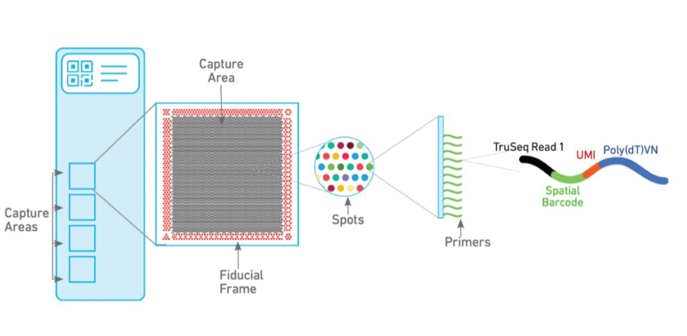
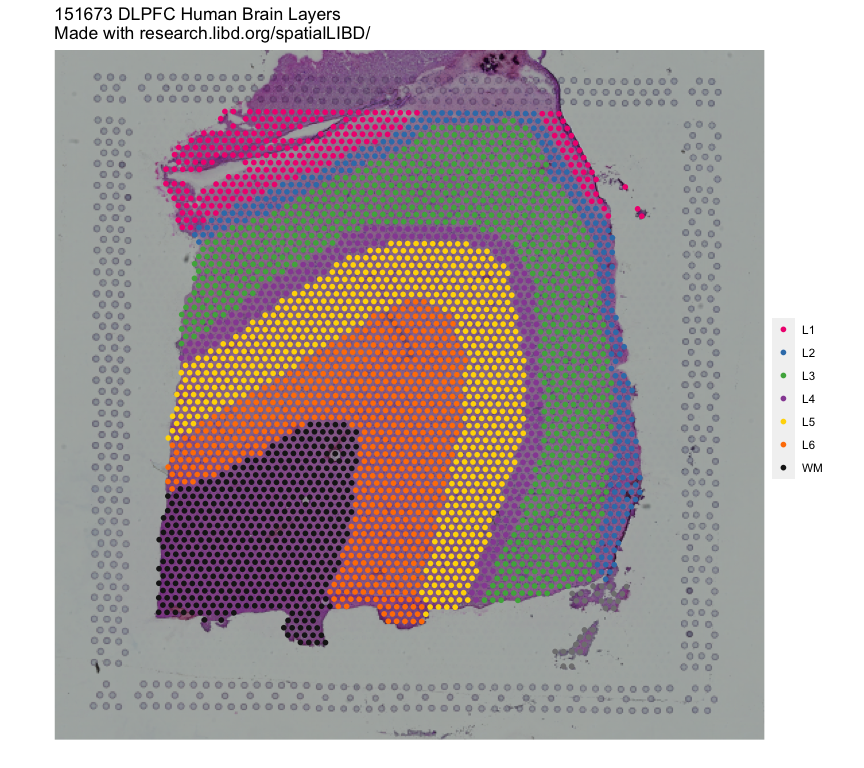

# Introduction to spatial transcriptomics

Instructor: Daianna Gonzalez-Padilla

You might also be interested in this recent blog post by Leo https://lcolladotor.github.io/2024/05/23/humanpilot-first-spatially-resolved-transcriptomics-study-using-visium/ and the companion walk through video

<iframe width="560" height="315" src="https://www.youtube.com/embed/HGioWKuI3ek?si=Bq5FT1UphMSQRO-E" title="YouTube video player" frameborder="0" allow="accelerometer; autoplay; clipboard-write; encrypted-media; gyroscope; picture-in-picture; web-share" referrerpolicy="strict-origin-when-cross-origin" allowfullscreen></iframe>

For a journal club presentation on the `HumanPilot` paper, check this video:

<iframe width="560" height="315" src="https://www.youtube.com/embed/qloLbG5-IPM?si=QsWfmCuW8ueypPek" title="YouTube video player" frameborder="0" allow="accelerometer; autoplay; clipboard-write; encrypted-media; gyroscope; picture-in-picture; web-share" referrerpolicy="strict-origin-when-cross-origin" allowfullscreen></iframe>

In recent years, with constant improvements in the current sequencing technologies and the generation of more sophisticated omics methodologies and bioinformatic pipelines, we have been constantly demonstrating that specific cell types and cell-to-cell interactions play critical roles in the definition of numerous diseases and development-related processes. In fact, cell type-specific associations have been established for a number of diseases and disorders. Thus, understanding the cellular context and the spatial location in which normal and deregulated cellular events occur is necessary to unveil the molecular underpinnings of disease pathologies and malfunctions of the organisms.

Spatial transcriptomics technologies are molecular profiling methods developed to measure gene expression levels in a tissue sample at the spatial resolution. These methods have been improved and expanded over time and are widely applied to study a wide range of biological processes and have provided numerous insights into disease and development mechanisms. 

In particular, the 10x Genomics Visium platform is a technology that spatially profiles the transcriptome of frozen and fixed tissue sections in combination with histology.

## 3' Visium spatial technology
This is the Visium technology more frequently used and it captures polyadenilated transcripts within individual spatially barcoded spots.

In the Visium expression slide there are 4 capture areas, each of 6.5 (+1.5) mm$^2$ with ~5k barcoded spots (55 µm in diameter each), within which mRNAs are captured by polyT primers that contain a read for sequencing (see below), a UMI (unique molecular identifier), and a spatial barcode. In this way, all RNAs trapped in the same spot are tagged with the same spot-specific barcode and we can computationally trace the original location of the transcripts.

<figure>
    
        <figcaption style="color: gray; line-height: 0.9; text-align: justify; caption-side: bottom">
            
                <b>Figure 1</b>: <b> Schematic representation of the Visium capture areas and spots.</b> Source: SciLifeLab (2023). 
                

</figcaption>
</figure>

## Spatial data visualization
In order to interactively visualize example spatial data we'll use the shiny web application of ***spatialLIBD***: http://spatial.libd.org/spatialLIBD/. This web application allows to browse the human dorsolateral pre-frontal cortex (DLPFC) spatial transcriptomics data generated at the LIBD using the 10x Genomics Visium platform. In total there are 12 DLPFC tissue sections from 3 donors, each spanning six classical histological layers plus the white matter (WM). 

<figure>
    
        <figcaption style="color: gray; line-height: 0.9; text-align: justify; caption-side: bottom">
            
                <b>Figure 2</b>: <b> Human DLPFC tissue section</b>. Spot plot depicting the 6 classical histological layers (L1-L6) and the white matter (WM) in a human DLPFC sample. 
                

</figcaption>
</figure>

### Spot-level data exploration
With this tool you can:

* Observe per-spot QC metrics and gene expression levels
* Explore spot clusters in the tissue sections
* Visualize the spot data on reduced dimensions 
* Manually annotate spots to layers and export your manual annotations
* Customize the spatial images

📝 **Exercise 1**: visualize the clustering of spots in all tissue sections using the different discrete variables to plot. Which one recapitulates better the six histological layers (plus the white matter) of the human DLPFC? 

📝 **Exercise 2**: explore the expression of *SNAP25* (neuronal marker gene), *MOBP* (oligodendrocyte/WM marker gene), and *PCP4* (layer 5 marker gene) in each DLPFC tissue section. What do you observe? Are there any spatial patterns in the expression of these genes?

### Layer-level data exploration
Layer-level data result from pseudo-bulking the spot-level data, i.e. from aggregating spot data from all spots assigned to a given layer.

At this level the tool allows to:

* Visualize the gene expression data at the layer level in reduced dimensions
* Plot the layer-level lognorm or raw expression of a gene across all tissue sections and extract DEGs among layers (ANOVA model), in a specific layer compared to the rest (enrichment model) or compared to another layer (pairwise model)

* Assess the enrichment of your own sets of genes of interest among the DEGs from these spatial DLPFC data
* Correlate gene-wise statistics for DE between sn/scRNA-seq data clusters/cell populations with the DE statistics in the human DLPFC layers provided in this study. This can be used to label your sn/scRNA-seq groups or clusters with the more molecularly-defined histological layers

📝 **Exercise 3**: plot the expression of *SNAP25*, *MOBP*, and *PCP4* in the different layers of each DLPFC tissue section. Are there any significant differences in the expression of these genes between layers under any of the statistical models for DGE?

    👉🏼 There is also the [*spatialLIBD*](https://bioconductor.org/packages/release/data/experiment/html/spatialLIBD.html) R/Bioconductor package you can use to interactively inspect your own spatial data in a shiny web app. 

## Bibliography {-}

1. SciLifeLab (2023). 10X Genomics Visium for Fresh Frozen samples. Web site: https://ngisweden.scilifelab.se/methods/10x-visium/

2. 10x Genomics (n.d.). Whole transcriptome discovery in the tissue context. Web site: https://www.10xgenomics.com/platforms/visium 
